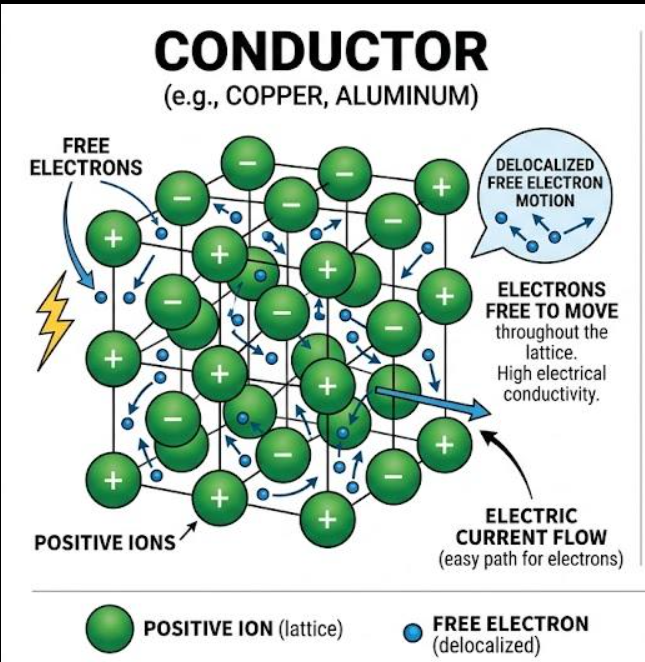
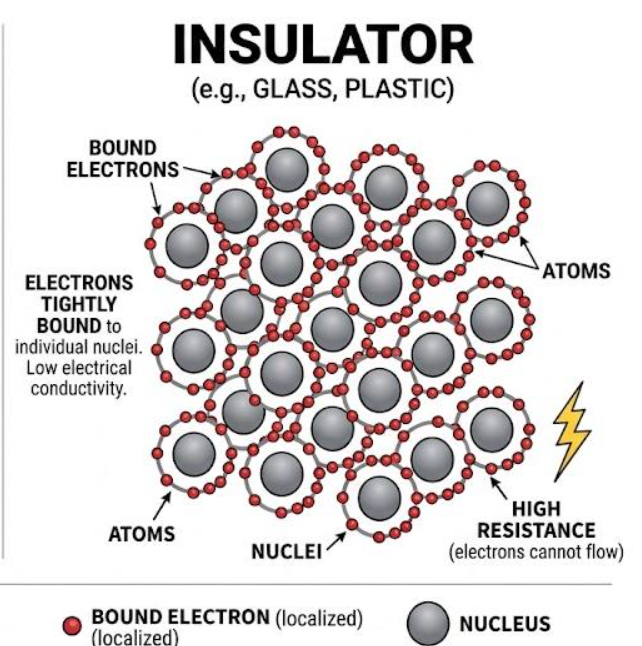
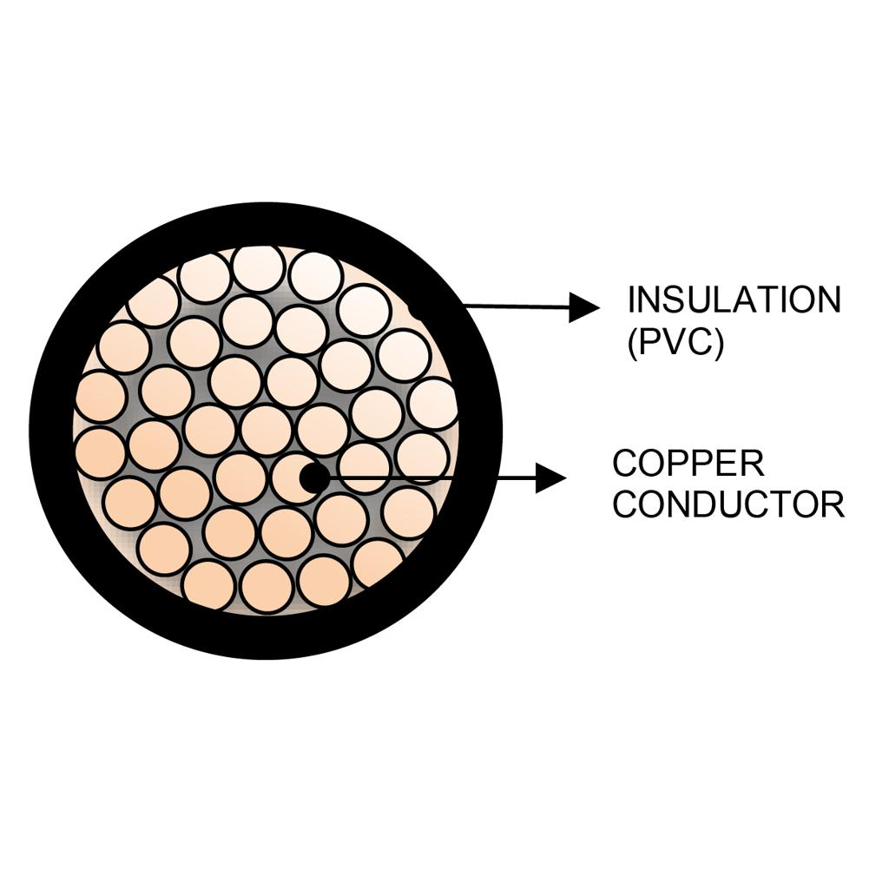
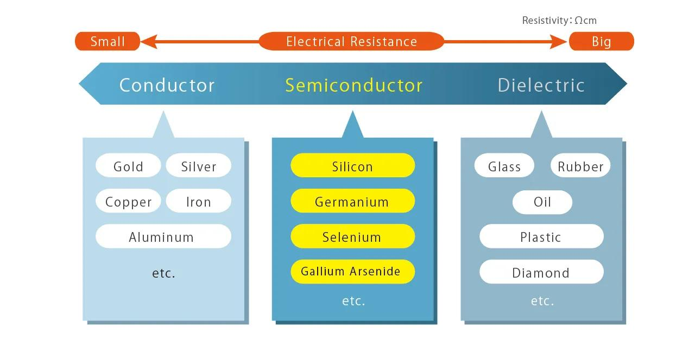
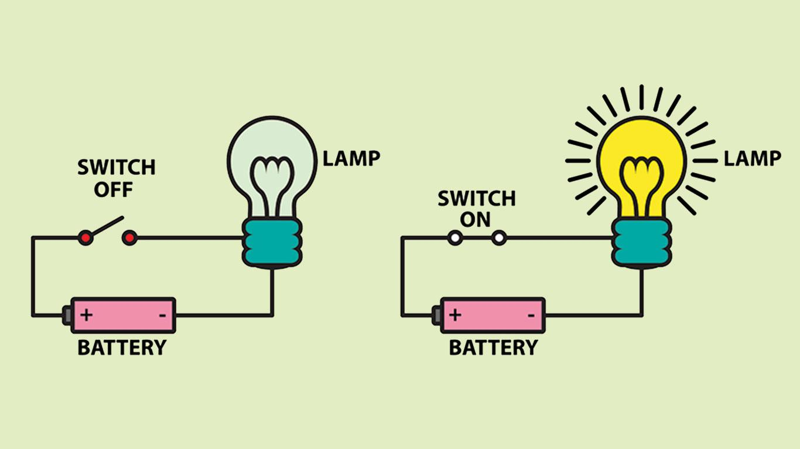
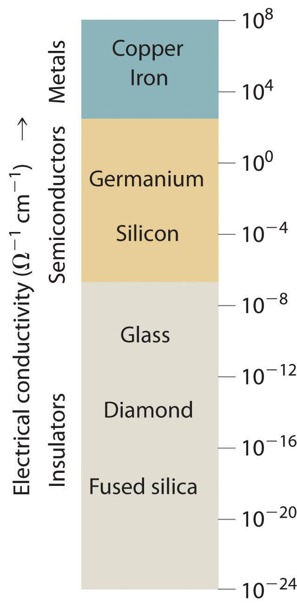

# Conductors, Insulators, and Semiconductors

> *"The entire digital world exists because one special class of materials can behave as both a conductor and an insulator."*

---

# Introduction

In the previous chapter, we learned that **electrons** are responsible for carrying electric current. We also discovered that different atoms hold their electrons with different strengths.

This naturally leads to an important question:

> **Why does electricity flow easily through a copper wire but not through a piece of plastic?**

The answer lies in how tightly a material holds its **valence electrons**.

Some materials allow electrons to move freely. Others hold them tightly, preventing current from flowing. A third group behaves somewhere in between—and these materials made the computer revolution possible.

In this chapter, we will study the three major classes of electrical materials:

- **Conductors**
- **Insulators**
- **Semiconductors**

Understanding these materials is essential because every electronic device—from a simple flashlight to a modern CPU—uses all three.

---

# Learning Objectives

After completing this lesson, you will be able to:

- Explain why materials conduct electricity differently.
- Define conductors, insulators, and semiconductors.
- Understand the role of valence electrons.
- Compare the electrical properties of different materials.
- Identify common examples of each material type.
- Explain why silicon is the foundation of modern computers.

---

# Prerequisite Knowledge

Before reading this lesson, you should understand:

- Electricity
- Electric current
- Electric charge
- Atoms
- Electrons
- Valence electrons

---

# Why Do Materials Behave Differently?

Every material is made of atoms.

However, not all atoms hold their outermost (valence) electrons with the same strength.

Some atoms allow electrons to move easily.

Others keep them tightly bound.

The easier electrons can move, the better the material conducts electricity.

Think of three different classrooms.

### Classroom 1 – Students Can Move Freely


Students can easily move around.

This is like a **conductor**.

---

### Classroom 2 – Students Cannot Leave Their Seats


Nobody can move.

This is like an **insulator**.

---

### Classroom 3 – Students Can Move Only with Permission

Movement is possible, but only under certain conditions.

This is like a **semiconductor**.

---

# What Is a Conductor?

A **conductor** is a material that allows electric current to flow easily.

In conductors, many electrons are **loosely bound** to their atoms.

These electrons can move freely when voltage is applied.




Since electrons move easily, conductors have **low electrical resistance**.

---

## Characteristics of Conductors

- Allow electricity to flow easily.
- Have many free-moving electrons.
- Low electrical resistance.
- Good conductors of heat.
- Widely used for electrical wiring.

---

## Common Conductors

| Material | Common Uses |
|----------|-------------|
| Copper | Electrical wires, PCBs |
| Silver | High-performance electronics |
| Gold | CPU pins, connectors |
| Aluminum | Power transmission lines |
| Graphite | Some electronic components |

Among these, **copper** is the most commonly used because it offers an excellent balance of conductivity, cost, and durability.

---

# Why Is Copper Used in Computers?

Inside a computer, electrical signals travel through microscopic metal connections.

Copper is ideal because it:

- Conducts electricity very well.
- Is relatively inexpensive.
- Is easy to manufacture.
- Resists corrosion better than many metals.

Modern processors contain kilometers of microscopic copper interconnects packed into a tiny chip.

---

# What Is an Insulator?

An **insulator** is a material that strongly resists the flow of electricity.

Its electrons are tightly held by their atoms and cannot move freely.





Because electrons cannot move easily, insulators have **high electrical resistance**.

---

## Characteristics of Insulators

- Block electric current.
- Electrons are tightly bound.
- High electrical resistance.
- Often poor conductors of heat.
- Used to improve electrical safety.

---

## Common Insulators

| Material | Common Uses |
|----------|-------------|
| Plastic | Wire coatings |
| Rubber | Electrical gloves |
| Glass | High-voltage insulation |
| Ceramic | Electronic components |
| Dry Wood | Electrical insulation |
| Air | Natural insulation |

---

# Why Are Insulators Important?

Without insulators:

- Electrical wires could touch each other.
- Short circuits would occur.
- Electric shocks would become common.
- Electronic devices would be unsafe.

For example:

.jpg)





The copper carries electricity.

The plastic protects you from it.

---

# What Is a Semiconductor?

A **semiconductor** is a material whose electrical conductivity lies between that of a conductor and an insulator.



A semiconductor:

- Sometimes behaves like a conductor.
- Sometimes behaves like an insulator.
- Can be controlled by engineers.

This ability to control conductivity is what makes modern electronics possible.

---

# Characteristics of Semiconductors

- Moderate conductivity.
- Neither a good conductor nor a good insulator.
- Conductivity can be changed.
- Sensitive to temperature, light, and impurities.
- Used to build electronic devices.

---

# Silicon: The Most Important Semiconductor

The most important semiconductor is **silicon (Si)**.

Silicon is the second most abundant element in Earth's crust, after oxygen.

Why silicon?

Because it has four valence electrons.

This makes it possible to carefully control how electricity flows through it.

Every modern:

- CPU
- GPU
- RAM chip
- SSD controller
- Smartphone processor
- Microcontroller

contains billions of silicon transistors.

---

# Why Not Build CPUs from Copper?

Copper conducts electricity extremely well.

At first, that sounds perfect.

However, there is a problem.

A transistor must behave like a switch.



Copper cannot easily switch between conducting and blocking electricity.

It always conducts.

Silicon, on the other hand, can be engineered to do both.

That makes it perfect for building transistors.

---

# Comparing the Three Materials

| Property | Conductors | Semiconductors | Insulators |
|----------|------------|----------------|-------------|
| Current Flow | Easy | Controlled | Very difficult |
| Resistance | Low | Medium | High |
| Free Electrons | Many | Few | Almost none |
| Used For | Wires | Chips | Protection |
| Example | Copper | Silicon | Plastic |

---

# Electrical Conductivity Scale



---

# How Computers Use All Three

A computer requires all three material types.

```
Computer

├── Copper
│     │
│     └── Carries electrical signals
│
├── Plastic
│     │
│     └── Prevents short circuits
│
└── Silicon
      │
      └── Controls electrical signals
```

Each material performs a unique job.

Without any one of them, modern computers would not function.

---

# Real-World Examples

### Conductors

- USB cables
- Ethernet cables
- Power supply wires
- Motherboard traces
- Processor interconnects

---

### Insulators

- Cable insulation
- PCB protective coatings
- Electrical gloves
- Ceramic chip packages

---

### Semiconductors

- CPUs
- GPUs
- RAM
- Flash memory
- Microcontrollers
- Sensors
- Solar panels
- Transistors

---

# Common Misconceptions

### ❌ Conductors have no resistance.

✅ Conductors have **low resistance**, not zero resistance.

---

### ❌ Plastic stops electricity because it has no electrons.

✅ Plastic contains electrons, but they are tightly bound and cannot move freely.

---

### ❌ Silicon is as conductive as copper.

✅ Silicon conducts much less than copper, but its conductivity can be controlled.

---

### ❌ Semiconductors are only used in computers.

✅ They are also used in LEDs, solar cells, sensors, power electronics, communication systems, and many other devices.

---

# Summary

Materials behave differently because they hold their valence electrons with different strengths.

- **Conductors** allow electrons to move easily.
- **Insulators** prevent electrons from moving.
- **Semiconductors** allow engineers to control electron movement.

This unique property of semiconductors makes them the foundation of all modern electronics.

---

# Key Takeaways

- Different materials conduct electricity differently.
- Conductors have many free-moving electrons.
- Insulators hold electrons tightly.
- Semiconductors have controllable conductivity.
- Copper is widely used for electrical wiring.
- Plastic is commonly used for insulation.
- Silicon is the most important semiconductor in computer engineering.
- Modern CPUs depend on billions of silicon transistors.

---

# Review Questions

1. What determines how well a material conducts electricity?
2. What is a conductor?
3. Why is copper commonly used for wires?
4. What is an insulator?
5. Why are insulators important for safety?
6. What is a semiconductor?
7. Why is silicon the most widely used semiconductor?
8. Why can't copper be used to build transistors?
9. Name three examples of conductors.
10. Name three examples of insulators.

---

# Mini Quiz

### 1. Which material is commonly used for electrical wiring?

A. Plastic

B. Glass

C. Copper

D. Rubber

**Answer:** C

---

### 2. Which material is the foundation of modern computer chips?

A. Gold

B. Iron

C. Silicon

D. Aluminum

**Answer:** C

---

### 3. Which material has the highest electrical resistance?

A. Copper

B. Silver

C. Plastic

D. Aluminum

**Answer:** C

---

### 4. Why are semiconductors important?

A. They never conduct electricity.

B. Their conductivity can be controlled.

C. They replace batteries.

D. They generate electricity automatically.

**Answer:** B

---

### 5. Which combination is correct?

A. Copper → Semiconductor

B. Plastic → Conductor

C. Silicon → Semiconductor

D. Glass → Conductor

**Answer:** C

---

# Further Reading

In this chapter, we learned that **silicon** is special because its electrical conductivity can be controlled.

The next question is:

**How do engineers control the conductivity of silicon?**

The answer is a process called **doping**, where tiny amounts of other elements are added to pure silicon to change its electrical behavior.

---

# What's Next?

Pure silicon alone is not enough to build transistors.

To create electronic switches, engineers must carefully modify silicon by introducing small amounts of other elements. This process produces **P-type** and **N-type** semiconductors, which are the essential building blocks of diodes and transistors.

In the next chapter, **Semiconductors and Doping**, we will explore how pure silicon is transformed into one of the most important materials in the history of computing.


➡️ **Next:** [05 Semiconductors and Doping](05_Semiconductors and Doping.md)