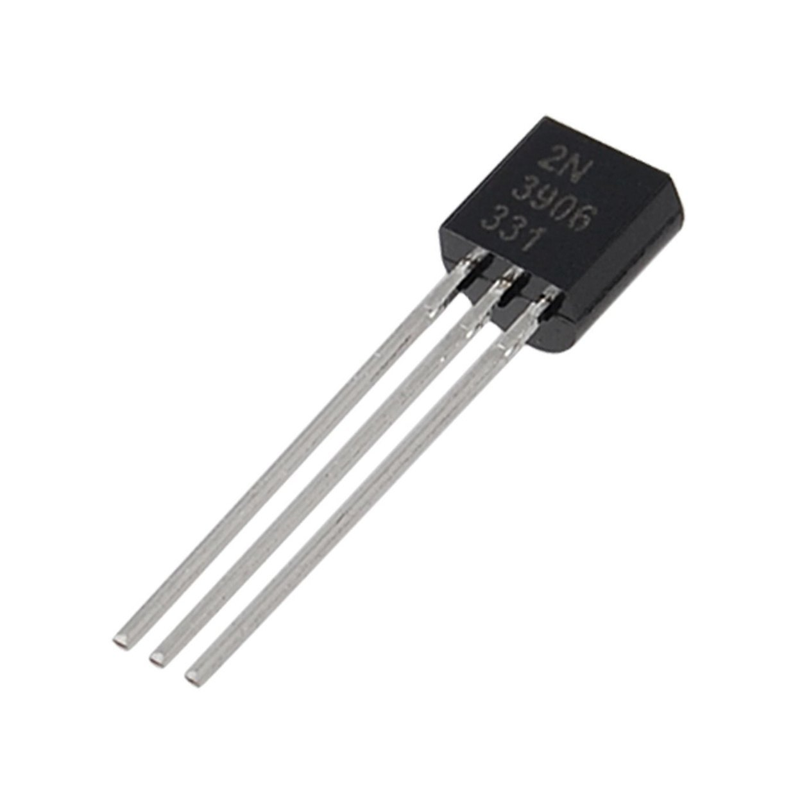
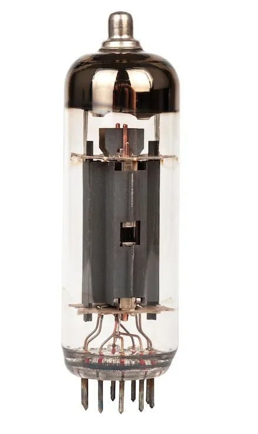
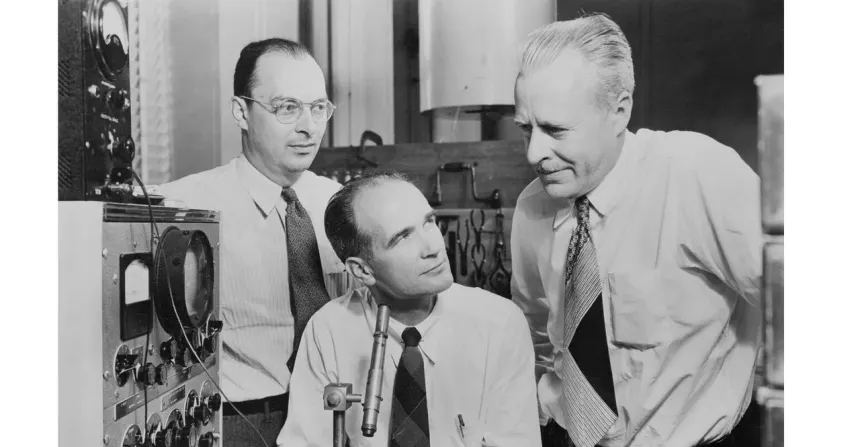
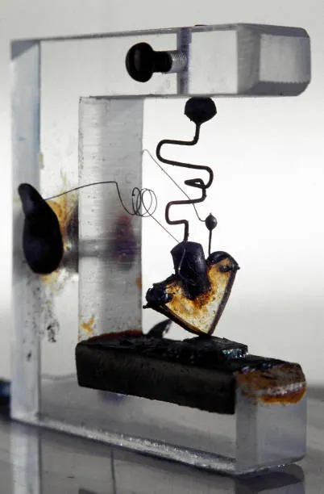

# Introduction

> *"Every modern computer—from a simple calculator to the world's fastest supercomputer—is built from billions of tiny electronic switches called transistors."*

Welcome to **Computer Architecture From Scratch**.

This project is a step-by-step journey through the inner workings of a computer. Instead of treating the CPU as a mysterious black box, we'll build one from the ground up, understanding every layer along the way.

By the end of this project, you'll know how a simple electronic switch can eventually become a fully programmable **8-bit processor** capable of executing machine code.

---

# Why This Project?

Many computer architecture courses begin with logic gates, assembly language, or CPU diagrams. While these topics are important, they often skip an essential question:

> **Where do logic gates come from?**

To answer that, we need to go one level deeper.

Logic gates are built from **transistors**.

Transistors are built using **semiconductor physics**.

Understanding these foundations makes the behavior of digital circuits much easier to understand.

This project follows the same path that computer hardware engineers follow when designing real processors.

---

# What Is a Computer?

At its core, a computer is a machine that performs four basic tasks:

1. Accepts input
2. Stores data
3. Processes information
4. Produces output

Whether you're using a smartphone, laptop, gaming console, or server, every computer performs these same fundamental operations.

---

# The Building Blocks of a Computer

Modern computers are built in layers.

```
Software
    │
Operating System
    │
Assembly Language
    │
Machine Code
    │
CPU
    │
Logic Gates
    │
Transistors
    │
Semiconductor Physics
```

In this project, we'll start at the **bottom** and work our way **up**.

---

# Why Start with Transistors?

A transistor is an electronic component that can act as a very fast switch.

It has only two important states:

```
OFF  → 0

ON   → 1
```

These two states form the basis of **binary**, the language used by all digital computers.

By combining millions—or even billions—of transistors, engineers create logic gates, memory, arithmetic units, and eventually complete processors.

---
# A Brief History of Automated Switching

As computers became more complex, manually flipping electrical switches became impossible. Engineers needed devices that could **automatically control the flow of electricity**.

The evolution happened in three major stages:

1. **Mechanical Switches** (Human operated)
2. **Relays** (Electrically operated mechanical switches)
3. **Vacuum Tubes** (Electronic switches with no moving parts)
4. **Transistors** (Modern electronic switches)

This section focuses on the first two automated technologies.

---

# Relays


Before electronic computers existed, engineers used **electromagnetic relays** to automate switching.

A relay is an **electrically controlled mechanical switch**.

## How a Relay Works


1. An electric current flows through a coil.
2. The coil creates a magnetic field.
3. The magnetic field pulls a metal arm.
4. The arm opens or closes an electrical contact.
5. Another circuit is turned ON or OFF.

This allowed one electrical signal to control another automatically.

---

## Advantages

- Easy to understand
- Reliable for simple control systems
- Can switch high voltages
- Still used today in industrial automation and electrical equipment

---

## Disadvantages

- Moving mechanical parts wear out
- Slow switching speed
- Produces clicking noise
- Limited lifespan
- Large compared to modern electronics

---

## Speed

A typical relay switches in about:

**≈ 10 milliseconds (ms)**

Although fast for humans, this was far too slow for future computers that would need millions or billions of operations every second.

---

## Why Computers Moved Beyond Relays

Mechanical movement creates a delay.

Every operation requires:

- Moving metal parts
- Waiting for contacts to close
- Waiting again to open

For large calculations, this became the biggest performance bottleneck.

Engineers needed a switch with **no moving parts**.

---

# Vacuum Tubes



The invention of the **vacuum tube** solved the speed problem.

Instead of moving metal contacts, vacuum tubes control the movement of **electrons inside a sealed glass tube**.

Since electrons move much faster than mechanical parts, vacuum tubes were **thousands of times faster than relays**.

They became the foundation of the first generation of electronic computers.

---

# What Is a Vacuum Tube?

A vacuum tube is an **electronic switch** that controls electrical current inside a glass tube from which nearly all air has been removed.

Because there are **no moving mechanical parts**, switching happens extremely quickly.

---

# How a Vacuum Tube Works


## Step 1 — Heating the Cathode

A small wire called the **filament** heats the **cathode**.

The cathode becomes extremely hot.

---

## Step 2 — Thermionic Emission

When heated enough, the cathode releases electrons.

This process is called **Thermionic Emission**.

Think of it as electrons "boiling off" the metal surface.

---

## Step 3 — Electron Flow

A positively charged **anode (plate)** attracts the free electrons.

Electrons travel across the vacuum.

Current now flows through the tube.

---

## Step 4 — The Control Grid

Between the cathode and anode is a thin wire mesh called the **control grid**.

It acts like an electronic gate.

- Negative voltage → Repels electrons → Current stops ❌
- Positive or less negative voltage → Electrons pass → Current flows ✅

A tiny voltage on the grid can control a much larger current.

This makes the vacuum tube an **electronic switch** and **amplifier**.

---

# Main Parts of a Vacuum Tube

| Part | Function |
|------|----------|
| Filament | Heats the cathode |
| Cathode | Emits electrons |
| Control Grid | Controls electron flow |
| Anode (Plate) | Collects electrons |

---

# Advantages of Vacuum Tubes

- Much faster than relays
- No moving mechanical parts
- Can amplify electrical signals
- Made electronic computers possible
- Enabled radio, television, and early communication systems

---

# Disadvantages of Vacuum Tubes

- Very large in size
- Made of fragile glass
- Consumed enormous amounts of electricity
- Generated excessive heat
- Required cooling systems
- Burned out frequently
- Expensive to manufacture and maintain
- Less reliable than modern electronics

---

# Speed Comparison

| Technology | Typical Switching Speed |
|------------|------------------------|
| Human-operated Switch | Seconds |
| Relay | ~10 milliseconds |
| Vacuum Tube | Microseconds |
| Modern Transistor | Nanoseconds to Picoseconds |

This dramatic improvement made electronic computing practical.

---
# Vacuum Tubes in Early Computers

The first electronic computers relied almost entirely on **vacuum tubes** for computation and switching.

Some famous vacuum tube computers include:

- **ENIAC** (Electronic Numerical Integrator and Computer)
- **EDVAC** (Electronic Discrete Variable Automatic Computer)
- **UNIVAC I** (Universal Automatic Computer I)
- **Colossus**

These machines contained **thousands to tens of thousands of vacuum tubes**.


### Reliability Problem

One major drawback of vacuum tube computers was **low reliability**.

- Vacuum tubes generated a large amount of heat.
- They consumed a significant amount of electrical power.
- Tubes frequently burned out or failed.
- If even **one vacuum tube** failed, the entire computer could stop working until the faulty tube was located and replaced.

Despite these limitations, vacuum tube computers marked the beginning of the electronic computing era and laid the foundation for modern computers.
---

# Challenges Faced by Early Computers

Because vacuum tubes generated so much heat:

- Entire rooms were needed to house computers.
- Large cooling systems were installed.
- Power consumption was extremely high.
- Maintenance engineers constantly replaced failed tubes.

Early computers could consume **tens to hundreds of kilowatts** of electrical power.

---

# Interesting Facts

💡 ENIAC contained approximately **17,468 vacuum tubes**.

💡 It weighed around **30 tons**.

💡 It occupied about **1,800 square feet (167 m²)** of floor space.

💡 It consumed roughly **150 kW** of electrical power.

💡 Thousands of tubes operated simultaneously, so failures occurred regularly.

---

# Why Vacuum Tubes Were Replaced

Although revolutionary, vacuum tubes had serious limitations.

Engineers wanted devices that were:

- Smaller
- Faster
- Cooler
- More reliable
- More energy efficient
- Less expensive

The solution arrived in **1947** with the invention of the **transistor** at Bell Labs.

The transistor would eventually replace nearly every vacuum tube and begin the modern age of computing.

---

## Key Takeaways

- Relays automated switching using electromagnets but were limited by moving parts.
- Vacuum tubes replaced mechanical switching with electronic switching.
- Thermionic emission allows heated cathodes to release electrons.
- The control grid acts as an electronic ON/OFF switch.
- Vacuum tubes made the first electronic computers possible.
- Their size, heat, power consumption, and unreliability eventually led to the invention of the transistor.
## The Invention of the Transistor


 the first transistor  was invented in **1947**   by **John Bardeen**,**Walter Brattain**, and **William Shockley** at **Bell Labs**..

 
 ## The first transistor
 
This breakthrough transformed the electronics industry.
Compared to vacuum tubes, transistors were:

- Smaller
- Faster
- More reliable
- More energy-efficient
- Easier to manufacture

This invention made modern computers possible.

---

## Integrated Circuits

As manufacturing technology improved, engineers began placing multiple transistors onto a single silicon chip.


First Monolithic Silicon IC Chip

These chips became known as **Integrated Circuits (ICs)**.

Instead of wiring thousands of individual transistors together, entire circuits could now fit on a single chip.

---

## Modern Processors

Today's CPUs contain **billions of transistors** packed into an area only a few square centimeters in size.

For example:

- Smartphones contain billions of transistors.
- Desktop processors contain tens of billions of transistors.
- High-performance AI chips can contain over one hundred billion transistors.

Despite this incredible scale, every transistor still behaves like a tiny electronic switch.

---

# Moore's Law

In 1965, engineer **Gordon Moore** observed that the number of transistors on integrated circuits was increasing rapidly over time.

This observation became known as **Moore's Law**.


For decades, the number of transistors on computer chips roughly doubled every two years, enabling computers to become:

- Faster
- Smaller
- More powerful
- More energy-efficient
- Less expensive per unit of performance

Although the pace has slowed in recent years, Moore's Law has had a profound influence on the evolution of computing.

---

# From One Transistor to a CPU

This project gradually builds a complete computer by stacking simple concepts.

```
One Transistor
        │
        ▼
Electronic Switch
        │
        ▼
   Logic Gates
        │
        ▼
Arithmetic Circuits
        │
        ▼
    Registers
        │
        ▼
     Memory
        │
        ▼
       ALU
        │
        ▼
   Control Unit
        │
        ▼
       CPU
        │
        ▼
     Computer
```

Every chapter builds directly on the previous one.

---

# What You Will Learn

By completing this project, you will understand:

- Basic electricity
- Semiconductors
- Transistors
- Digital logic
- Binary numbers
- Logic gates
- Adders and multiplexers
- Memory systems
- Registers
- Arithmetic Logic Units (ALUs)
- Control units
- Instruction Set Architecture (ISA)
- Assembly language
- CPU execution cycles
- Computer architecture fundamentals

More importantly, you'll understand **how these concepts connect together**.

---

# Project Philosophy

This project follows three guiding principles:

## Learn by Building

Every concept is accompanied by practical implementations and simulations.

---

## Start Simple

Complex systems become easier to understand when broken down into small, manageable pieces.

---

## Understand Every Layer

Rather than memorizing diagrams, you'll build each layer yourself and see how it contributes to the complete system.

---

# Prerequisites

You do **not** need prior knowledge of:

- Electronics
- Computer architecture
- Digital logic
- Assembly language
- Processor design

Basic familiarity with programming is helpful but not required.

---

# What's Next?

Now that you understand the purpose and roadmap of this project, the next chapter introduces the fundamental concepts of electricity.

We'll answer questions such as:

- What is electricity?
- What are electrons?
- How does electric current flow?
- What is voltage?
- Why does electricity move through some materials but not others?

These concepts form the foundation for understanding semiconductors and, ultimately, transistors.

---

## Summary

In this chapter, you learned:

- Why computers are built from transistors.
- Why understanding transistors is important.
- The evolution from vacuum tubes to modern processors.
- The concept of Moore's Law.
- The learning roadmap for this project.
- What you will build by the end of the course.

In the next chapter, we'll begin with the fundamentals of **electricity**, the science that makes every computer possible.

➡️ **Next:** [02 Electricity Basics](02_electricity_basics.md)