# Electricity Basics

> *"Electricity is not something computers use—it is what computers are built upon."*

---

# Introduction

Before we can understand transistors, logic gates, memory, or CPUs, we must first understand **electricity**.

Every operation inside a computer—from displaying a pixel on your screen to running a video game—is performed by tiny electrical signals moving through billions of microscopic circuits.

Electricity is the foundation of all modern electronic devices. Although we cannot see it directly, we can observe its effects every day. It powers lights, charges smartphones, runs refrigerators, and allows computers to perform billions of calculations every second.

In this lesson, we will build a strong understanding of what electricity is, how it moves, and the basic quantities engineers use to describe it.

---

# Learning Objectives

After completing this lesson, you will be able to:

- Explain what electricity is.
- Understand electric charge.
- Describe electric current.
- Understand voltage and why it is important.
- Explain electrical resistance.
- Distinguish between conductors and insulators at a basic level.
- Read simple circuit diagrams.
- Understand why electricity is the foundation of digital computers.

---

# Prerequisite Knowledge

This lesson requires **no prior knowledge**.

---

# Why Study Electricity?

Imagine trying to understand how a car engine works without knowing what fuel is.

The same is true for computers.

A computer cannot function without electricity. Every processor, memory chip, storage device, and display depends on controlled electrical signals.

Later in this book, we will discover that:

- A transistor is simply an electrically controlled switch.
- Logic gates are built from transistors.
- CPUs are built from logic gates.
- Computers are built from CPUs and memory.

Everything begins with electricity.

---

# What Is Electricity?


Electricity is the **movement or presence of electric charge**.

An **electric charge** is a property of matter that causes electrical forces.

There are two kinds of charge:

- Positive (+)
- Negative (−)

## Opposite charges attract each other.
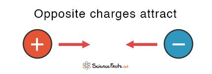
## Like charges repel each other.

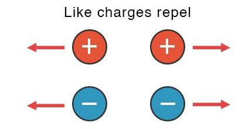


Most electrical circuits work because tiny negatively charged particles called **electrons** move through materials.

We will study electrons in detail in the next chapter.

---

# Static Electricity vs Current Electricity

There are two common forms of electricity.
## Static electricity
**Static electricity** is caused by a buildup of electric charge on an object's surface. When the charge suddenly moves to another object, you feel a small shock.


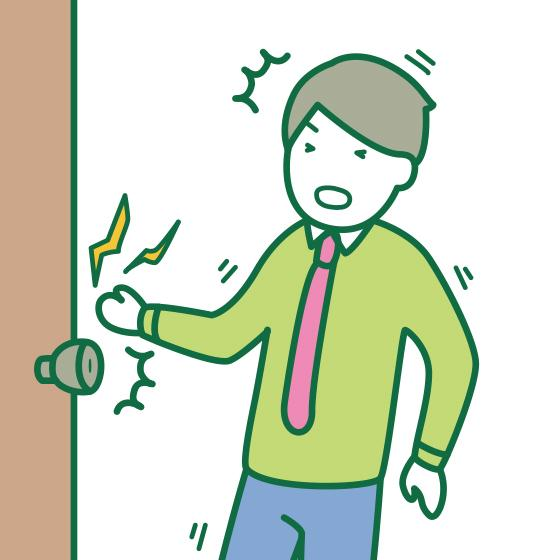
## Current electricity

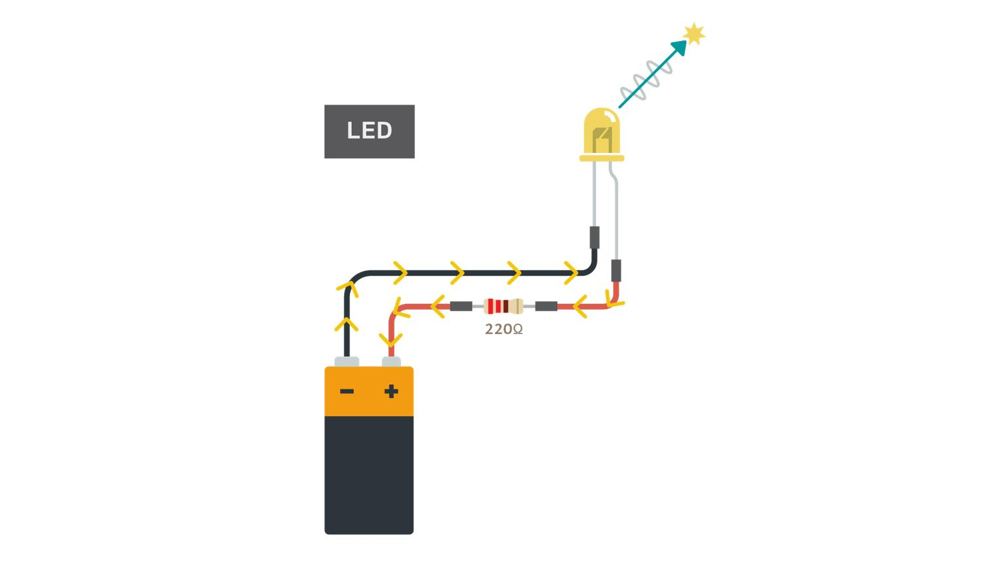

**Current electricity** is a continuous movement of electrons through a conductor. Nearly every electronic device uses current electricity.


| Type | Description | Example |
|------|-------------|---------|
| Static Electricity | Charges remain in one place until discharged | Shock after walking on carpet |
| Current Electricity | Charges continuously flow through a circuit | Computers, lights, fans |


Computers use **current electricity**.

---

# What Is an Electric Circuit?

Electricity must travel through a **complete path**.

This path is called an **electric circuit**.

If the path is broken, electricity stops flowing.

Example:
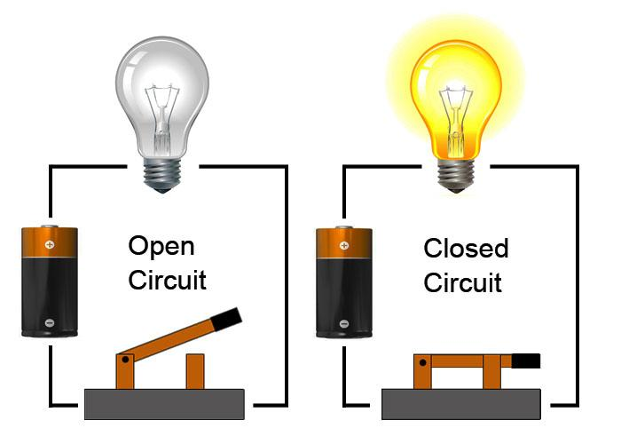
If the switch is closed:

- The path is complete.
- Electricity flows.
- The bulb lights.

If the switch is open:
- The path is broken.
- No electricity flows.

## Basic Circuit Components

| Component | Purpose |
|-----------|---------|
| Battery | Provides electrical energy |
| Wire | Carries electric current |
| Switch | Opens or closes the circuit |
| Load (Bulb, LED, Motor) | Uses electrical energy |
---

# Electric Charge

Everything around us is made of atoms.

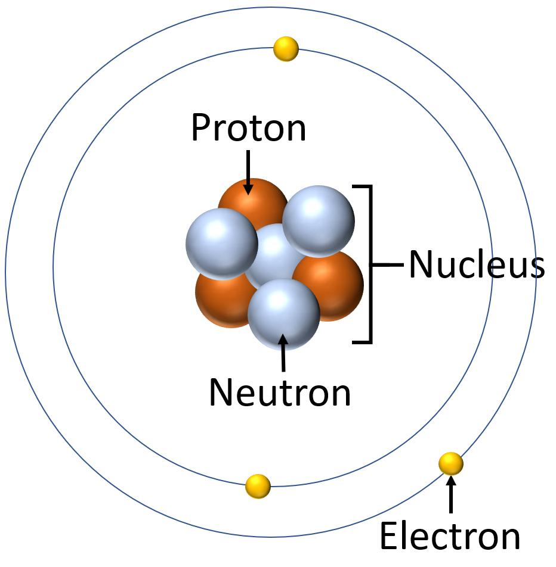

Inside atoms are tiny particles.

One of these particles is the **electron**, which carries a **negative electric charge**.

When many electrons move together through a conductor, we observe electricity.

Think of electric charge as the "thing" that electricity moves.
## 💡 Interesting Fact

Atoms contain:

- **Protons (+)**
- **Neutrons (0)**
- **Electrons (−)**

> **Only electrons move easily in electrical circuits.**
---

# Electric Current

Electric current is the **flow of electric charge through a circuit**.

Imagine water flowing through a pipe.

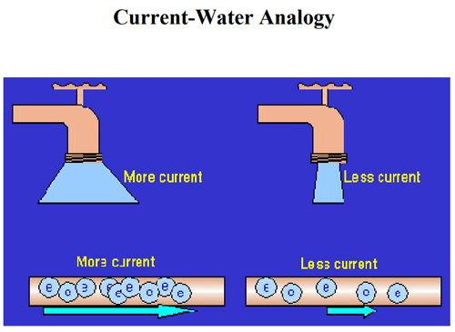

Electric current behaves similarly.

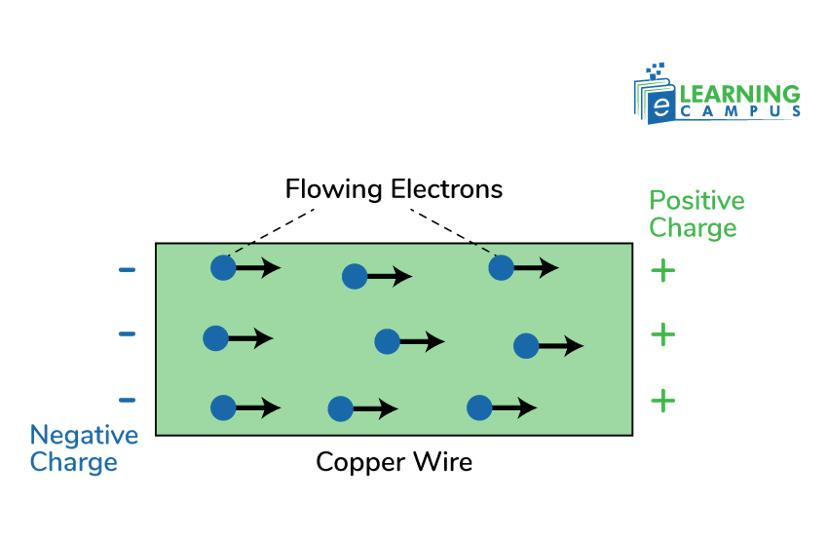

Current tells us **how much electric charge passes a point every second**.

The unit of current is the **ampere (A)**, often shortened to **amp**.

Example:

- Phone charger: around 2 A
- USB port: about 0.5–3 A
- CPU transistor currents: extremely tiny

---

# Conventional Current vs Electron Flow

Historically, scientists believed electricity flowed from positive to negative.

Later, they discovered that electrons actually move from negative to positive.


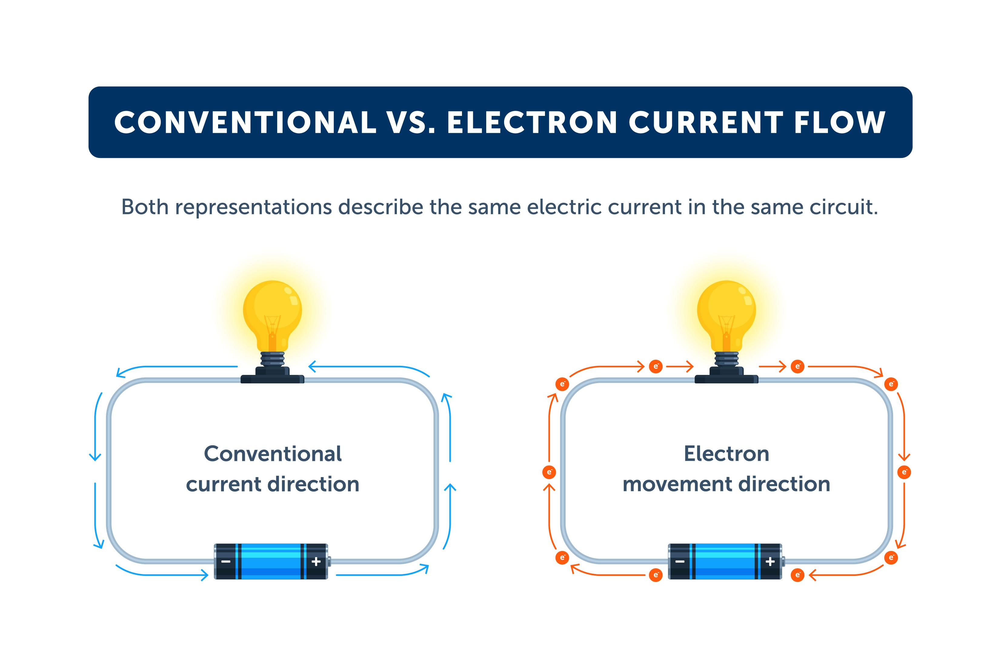

Today:

- Engineers usually use **conventional current** in circuit diagrams.
- Semiconductor engineers often think in terms of **electron flow**.

Both conventions describe the same electrical behavior.
## Why Learn Both?

There are two ways to describe the direction of electric current:

- **Physics** usually focuses on **electron flow**, where electrons move from the **negative (−)** terminal to the **positive (+)** terminal.
- **Circuit diagrams** and most electrical engineering books use **conventional current**, which flows from the **positive (+)** terminal to the **negative (−)** terminal.

Although the directions are opposite, **both describe the same electrical circuit**.

### Why Is This Important?

Understanding both current directions helps you:

- Read and understand **circuit diagrams**
- Learn **electronics** more easily
- Understand how **computer hardware** works
- Study **computer architecture**, digital circuits, and microprocessors
- Avoid confusion when reading different textbooks and technical documents

> **Remember:**  
> **Electrons move from − to +** (Electron Flow)  
> **Conventional current flows from + to −** (Used in circuit diagrams)
---

# Voltage

Voltage is the **electrical pressure** that pushes electric charges through a circuit.

Imagine squeezing a water hose.

The harder you squeeze, the greater the water pressure.

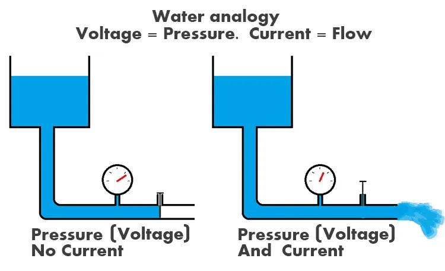

Voltage works in a similar way.

Higher voltage means greater electrical "push."

The unit of voltage is the **volt (V)**.

Examples:

| Device | Voltage |
|---------|----------|
| AA Battery | 1.5 V |
| USB | 5 V |
| Laptop Charger | 19–20 V |
| Desktop Power Supply | Multiple voltages |

Without voltage, electric charges would not move.

---

# Resistance

Not every material allows electricity to flow easily.

Some materials slow it down.

This opposition is called **resistance**.

Imagine walking through:

- An empty hallway.
- A crowded hallway.

Which is easier?

The empty hallway.

Electric current experiences something similar.

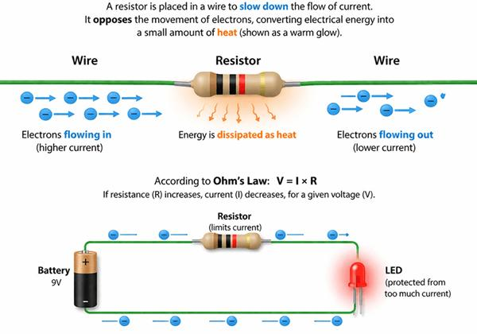

The unit of resistance is the **ohm (Ω)**.

Higher resistance means:

- Less current
- More opposition

Lower resistance means:

- Easier current flow
## Conductors vs Insulators

Materials are classified based on how easily electricity can pass through them.

### Conductors
Conductors allow electric current to flow easily because they have many free electrons.

Examples:
- Copper
- Silver
- Aluminum

### Insulators
Insulators resist the flow of electric current because their electrons are tightly bound.

Examples:
- Plastic
- Rubber
- Glass

## Conductivity of Common Materials

| Material | Conductivity |
|----------|--------------|
| Copper | Excellent |
| Silver | Excellent |
| Aluminum | Very Good |
| Plastic | Poor |
| Rubber | Poor |
| Glass | Poor |

> **Remember:**  
> **Conductors** let electricity **flow easily**, while **insulators** **block or greatly reduce** the flow of electricity.
---

# The Three Most Important Electrical Quantities

Electric circuits are mainly described using three quantities.

| Quantity | Symbol | Unit | Meaning |
|----------|--------|------|---------|
| Voltage | V | Volt | Electrical pressure |
| Current | I | Ampere | Flow of charge |
| Resistance | R | Ohm | Opposition to current |

## Easy Memory Trick

- Voltage = Push

- Current = Flow

- Resistance = Obstacle

These three quantities are related by **Ohm's Law**, which we will study in a later lesson.

---

# Simple Circuit Example

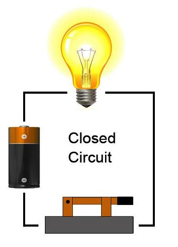

Electricity flows only when the switch closes the circuit.

---

# How Electricity Is Used Inside a Computer

Inside a computer, electricity performs many jobs.

It:

- Carries binary data.
- Switches transistors on and off.
- Stores bits in memory.
- Synchronizes circuits using the clock.
- Transfers information between components.
- Powers every electronic device.

A modern CPU contains billions of transistors.

Each transistor uses tiny electrical signals to represent binary values:

```
High Voltage → Logic 1

Low Voltage → Logic 0
```

These simple voltage levels become the language of computers.

---

# Real-World Applications

Electricity is used in:

- Desktop computers
- Laptops
- Smartphones
- Tablets
- Routers
- Game consoles
- Microcontrollers
- SSDs
- GPUs
- RAM
- Data centers

Every digital device depends on carefully controlled electrical signals.

---

# Common Misconceptions

### ❌ Electricity is the same as electrons.

✅ Electrons are tiny particles. Electricity is the movement or effect of electric charge.

---

### ❌ Voltage is electricity.

✅ Voltage is the force that pushes electric charge.

---

### ❌ Current and voltage are the same.

✅ Voltage pushes.

Current flows.

---

### ❌ Electricity always flows.

✅ Electricity flows only when a complete circuit exists.

---

# Summary

Electricity is the movement of electric charge through a circuit.

To understand electrical circuits, engineers describe three important quantities:

- Voltage (push)
- Current (flow)
- Resistance (opposition)

These concepts form the language of electronics and are essential for understanding transistors, logic gates, and computers.

---

# Key Takeaways

- Electricity is based on electric charge.
- Computers use current electricity.
- A complete circuit is required for current to flow.
- Voltage provides the electrical push.
- Current is the flow of electric charge.
- Resistance opposes current flow.
- Every computer operation depends on electrical signals.
- Modern CPUs represent binary data using different voltage levels.

---

# Review Questions

1. What is electricity?
2. What are the two types of electric charge?
3. What is an electric circuit?
4. Why does electricity stop flowing when a switch is open?
5. What is electric current?
6. What does voltage represent?
7. What is resistance?
8. Name the SI units of voltage, current, and resistance.
9. Why is electricity important in computers?
10. What do high and low voltage levels represent inside digital circuits?

---

# Mini Quiz

### 1. Which quantity represents electrical pressure?

A. Current

B. Resistance

C. Voltage

D. Power

**Answer:** C

---

### 2. Which unit measures electric current?

A. Volt

B. Ohm

C. Ampere

D. Watt

**Answer:** C

---

### 3. A broken circuit causes:

A. Higher voltage

B. Lower resistance

C. Current to stop flowing

D. More electrons

**Answer:** C

---

### 4. Which quantity opposes current flow?

A. Voltage

B. Resistance

C. Charge

D. Frequency

**Answer:** B

---

### 5. Inside digital computers, binary values are commonly represented using:

A. Different wire colors

B. Different voltages

C. Different materials

D. Different battery sizes

**Answer:** B

---

# Further Reading

Before moving forward, make sure you understand:

- Electric charge
- Current
- Voltage
- Resistance
- Simple electrical circuits

These concepts will be used repeatedly throughout this book.

---

# What's Next?

Now that we understand the basics of electricity, an important question remains:

**What exactly is moving inside a wire?**

To answer that, we must look much deeper—inside matter itself.

In the next lesson, **"Atoms and Electrons,"** we will explore the tiny building blocks of matter and discover how the movement of electrons creates the electrical signals that power every modern computer.


➡️ **Next:** [03 Atoms and Electrons](03_Atoms and Electrons.md)