# Semiconductor Physics

> *"Semiconductor physics explains why a tiny piece of silicon can store memories, perform calculations, and power billions of transistors inside a modern CPU."*

---

# Introduction

In the previous chapters, we learned:

- What electricity is.
- How atoms and electrons work.
- The difference between conductors, insulators, and semiconductors.
- How doping creates P-type and N-type semiconductors.

Now it is time to answer a deeper question:

> **Why does silicon behave differently from metals like copper?**

The answer lies in **Semiconductor Physics**.

Semiconductor physics studies how electrons behave inside semiconductor materials such as silicon and germanium. It explains why silicon can sometimes act as an insulator, sometimes as a conductor, and—most importantly—how engineers can precisely control its electrical behavior.

Without semiconductor physics, modern electronics would not exist.

Every processor, memory chip, graphics card, smartphone, and microcontroller depends on these physical principles.

---

# Learning Objectives

After completing this lesson, you will be able to:

- Define semiconductor physics.
- Understand the crystal structure of silicon.
- Explain energy bands.
- Distinguish between the valence band and conduction band.
- Define the band gap.
- Explain how electrons move in semiconductors.
- Understand electron-hole pair generation.
- Explain recombination.
- Understand intrinsic and extrinsic semiconductors from a physics perspective.
- Prepare for learning about PN junctions and transistors.

---

# Prerequisite Knowledge

Before reading this lesson, you should understand:

- Electricity
- Atoms
- Electrons
- Valence electrons
- Covalent bonds
- Semiconductors
- Doping
- P-type and N-type semiconductors

---

# What Is Semiconductor Physics?

**Semiconductor Physics** is the branch of physics that studies how electrons behave inside semiconductor materials.

It explains:

- Why silicon conducts electricity differently from copper.
- How electrons gain energy.
- Why holes exist.
- How current flows through semiconductor devices.
- How transistors switch on and off.

It combines ideas from:

- Atomic Physics
- Solid-State Physics
- Quantum Physics
- Electronics

Fortunately, we only need the essential concepts to understand computer architecture.

---

# What Is a Crystal?

A **crystal** is a solid material in which atoms are arranged in a regular repeating pattern.

Silicon atoms form one of the most organized crystal structures found in nature.

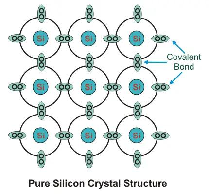

Every silicon atom shares electrons with four neighboring atoms.

This repeating arrangement is called a **crystal lattice**.

---

# Why Crystal Structure Matters

Imagine trying to walk across:

- A well-organized city
- A dense forest

Movement is much easier in the organized city.

Similarly, electrons move differently inside an organized crystal than they would inside a random arrangement of atoms.

The crystal lattice determines:

- Electrical conductivity
- Heat transfer
- Electron movement
- Semiconductor behavior

---

# Energy Levels in Individual Atoms

Earlier, we learned that electrons occupy **energy levels** around an atom.

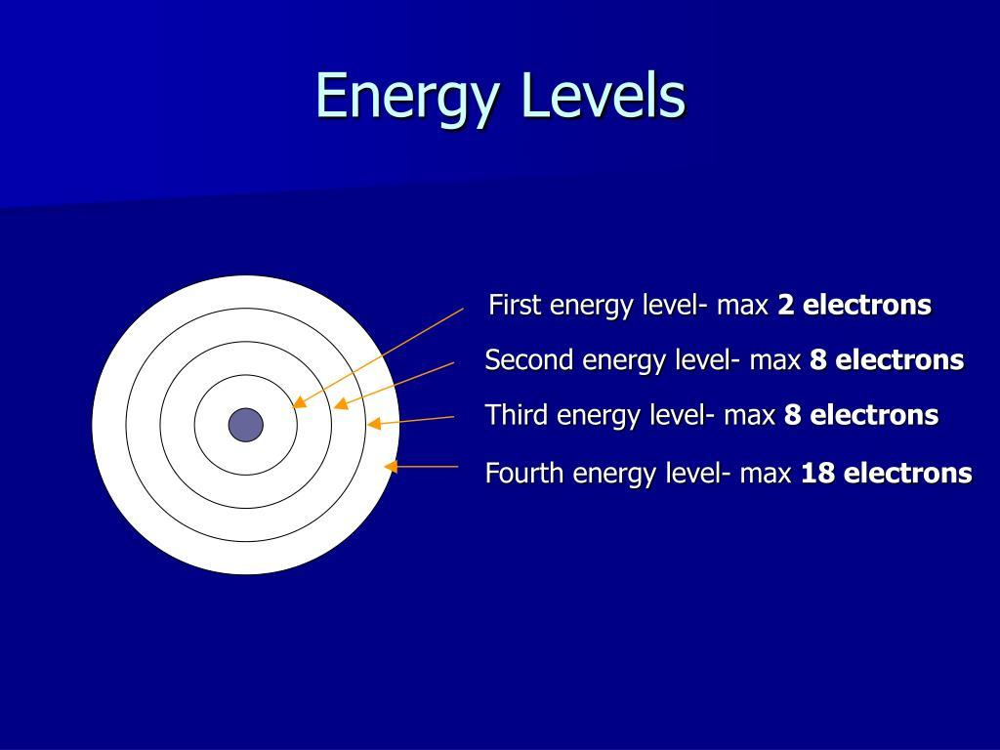

Electrons closer to the nucleus have lower energy.

Electrons farther away have higher energy.

---

# From Energy Levels to Energy Bands

When billions of silicon atoms join together, their individual energy levels overlap.

Instead of separate energy levels, they form **energy bands**.
# Why Bands Form

An isolated atom has **discrete (individual) electron energy levels**. Electrons can occupy only these specific energy levels.

When **billions of identical atoms** come together to form a crystal (such as silicon), the atoms are packed so closely that their outer electron wavefunctions begin to **overlap and interact**.

Because of the **Pauli Exclusion Principle**, two electrons in the same quantum system cannot have exactly the same quantum state. As a result, the originally identical energy levels of neighboring atoms **split into many slightly different energy levels**.

Since a crystal contains an enormous number of atoms (typically around **10²³ atoms**), each original energy level splits into **about 10²³ extremely closely spaced energy levels**. These levels are so close together that they appear to form **continuous energy bands** rather than separate levels.

This process creates two important bands:

- **Valence Band (VB):** The band formed from the outer electrons that participate in chemical bonding. It is normally filled with electrons.
- **Conduction Band (CB):** The higher-energy band where electrons are free to move through the crystal, allowing electrical conduction.

Between these two bands lies the **band gap (forbidden energy gap)**, an energy region where no electron energy states exist.

---

## In Simple Terms

- **One atom** → Separate (discrete) energy levels.
- **Many atoms together** → Atomic interactions cause each level to split.
- **Billions of atoms** → Millions of billions of split levels merge into continuous **energy bands**.

Therefore, solids have **energy bands** instead of the discrete energy levels found in isolated atoms. The size of the **band gap** determines whether a material behaves as a **conductor**, **semiconductor**, or **insulator**.

Think of this as many staircases joining together to become one large platform.

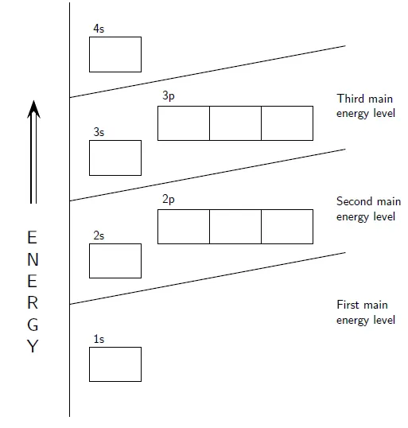

These bands determine whether electrons can move freely.

---

# The Two Most Important Energy Bands

Semiconductor physics mainly focuses on two energy bands.

## 1. Valence Band

The **valence band** contains electrons involved in covalent bonds.

These electrons normally cannot move freely.

## 2. Conduction Band

The **conduction band** contains electrons that are free to move throughout the crystal.

Electrons in this band create electric current.

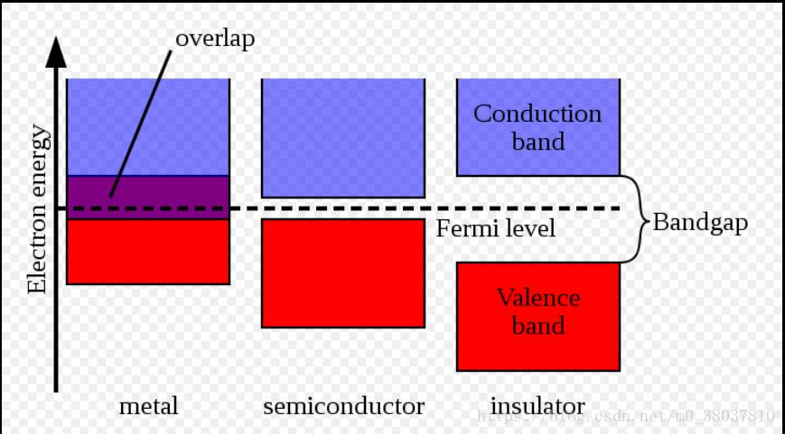

---

# The Band Gap

Between the valence band and conduction band is a region where electrons cannot normally exist.

This region is called the **band gap**.

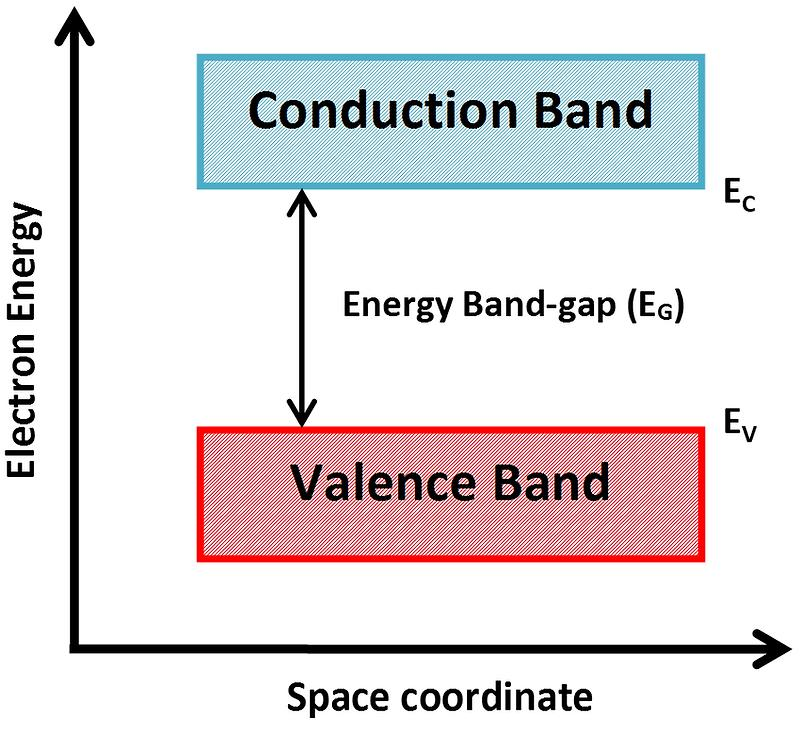

The size of this gap determines whether a material is:

- A conductor
- A semiconductor
- An insulator

---

# Comparing Materials Using Band Gaps

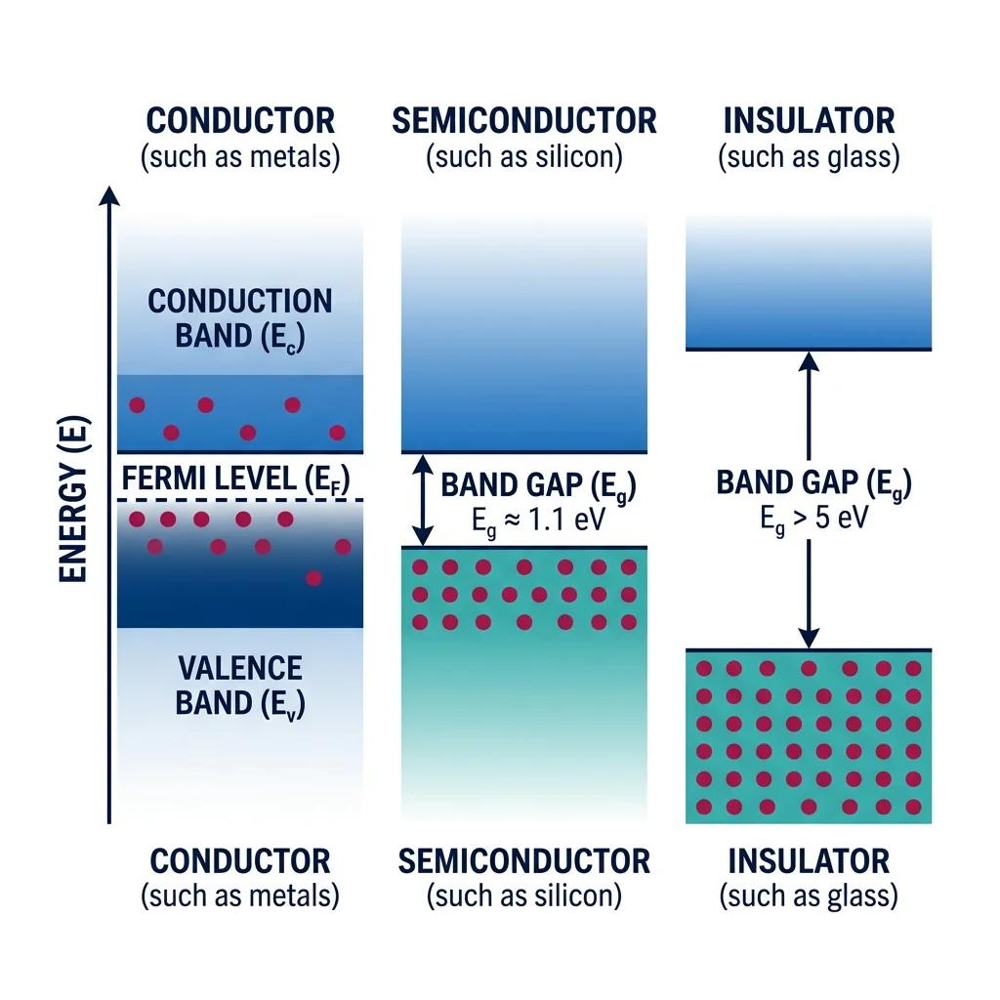

---

| Material | Band Gap | Conductivity |
|-----------|----------|--------------|
| Copper | None (bands overlap) | Very High |
| Silicon | Small | Moderate |
| Glass | Large | Very Low |

---

# Why Silicon Is Special

Silicon has a **small band gap**.

This means:

- Electrons normally remain in the valence band.
- With a little energy, they can jump into the conduction band.

This controlled movement makes silicon perfect for electronics.

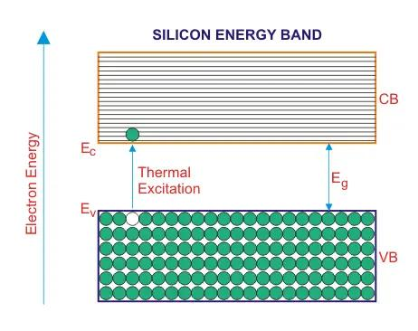

---

# Electron Excitation

When an electron gains enough energy, it can jump across the band gap.

For an electron to move from the **valence band** to the **conduction band**, it must gain energy equal to or greater than the **band gap energy**.

Electrons can gain this energy from several sources:

- **Heat (Thermal Energy):** Increased temperature causes atoms to vibrate, allowing some electrons to gain enough energy to cross the band gap.
- **Light (Photons):** A photon with energy equal to or greater than the band gap can excite an electron into the conduction band. This is the principle behind **solar cells** and **photodiodes**.
- **Electric Fields:** A strong electric field accelerates electrons, increasing their energy until they can move into the conduction band.
- **High-Energy Particles:** Particles such as alpha particles, beta particles, X-rays, or gamma rays can transfer sufficient energy to electrons, exciting them into the conduction band.

> **Key Point:** An electron can conduct electricity only after it gains enough energy to cross the **band gap** and enter the **conduction band**.

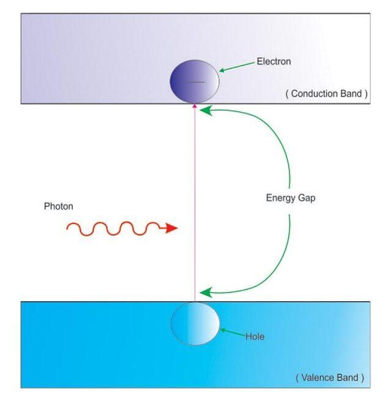

This process is called **electron excitation**.

---

# Electron-Hole Pair Generation

When an electron leaves the valence band:

- It enters the conduction band.
- It leaves behind an empty position.

That empty position is called a **hole**.

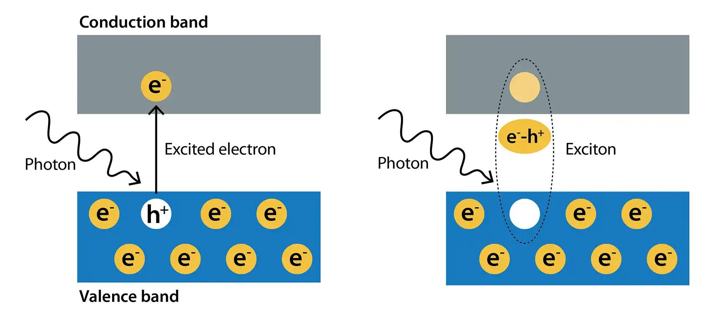

The electron and hole are created together.

They are called an **electron-hole pair**.

---

# Recombination

Eventually, a free electron may fall back into a hole.

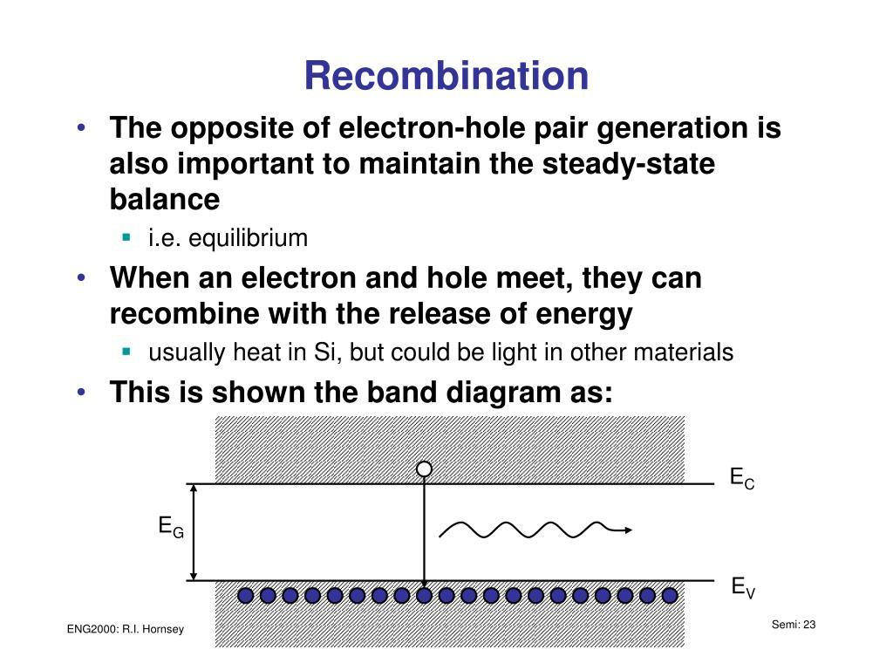

After recombination:

- The free electron disappears.
- The hole disappears.

Electron-hole pairs are constantly being created and recombined.

---

# Charge Carriers

Current in semiconductors is carried by:

## Electrons

Negative charge carriers.

## Holes

Positive charge carriers.

Both contribute to electrical conduction.

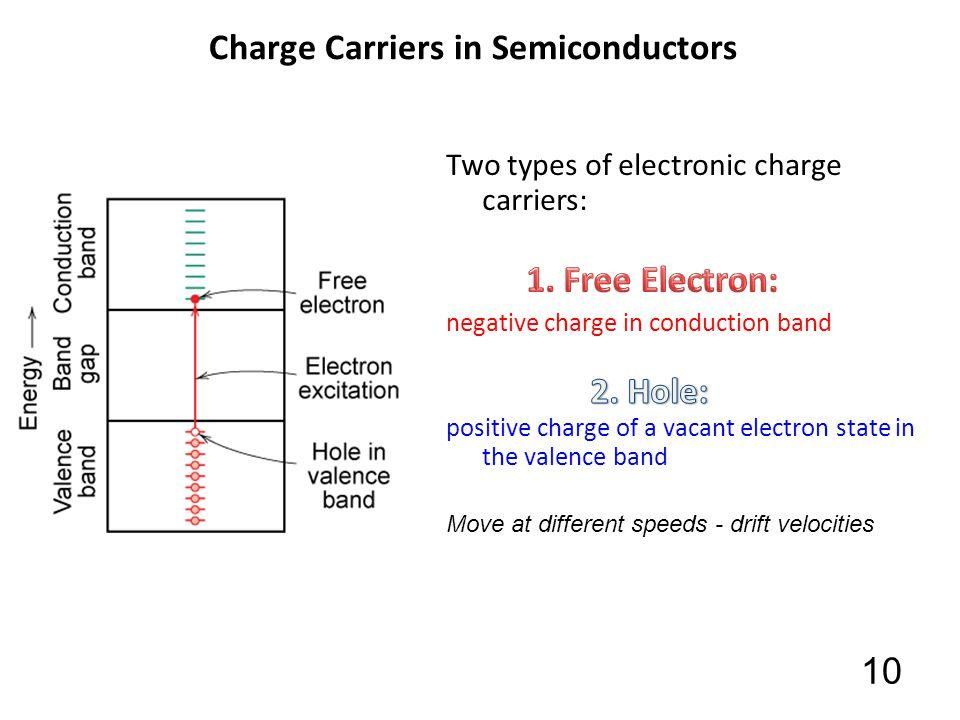

---

# Intrinsic Semiconductor Physics

Pure silicon is called an **intrinsic semiconductor**.

Current flows because thermal energy creates small numbers of electron-hole pairs.

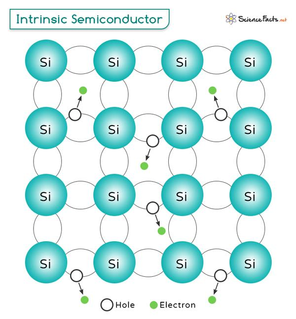

This conductivity is relatively low.

---

# Extrinsic Semiconductor Physics

Doping introduces additional charge carriers.

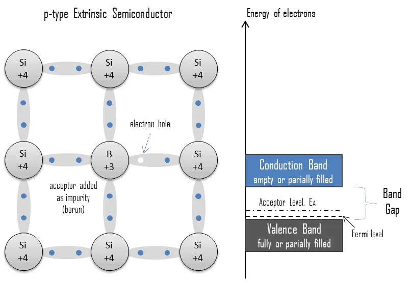

N-type silicon has many electrons.

P-type silicon has many holes.

This greatly improves conductivity.

---

# Why Semiconductor Physics Matters

Semiconductor physics explains:

- Why transistors switch.
- Why diodes conduct in one direction.
- Why memory stores bits.
- Why processors consume power.
- Why chips generate heat.
- Why modern CPUs contain billions of transistors.

Without semiconductor physics, integrated circuits could never be designed.

---

# Real-World Applications

Semiconductor physics is used in:

- CPUs
- GPUs
- RAM
- SSD controllers
- CMOS image sensors
- Solar cells
- LEDs
- Laser diodes
- Power electronics
- AI accelerators
- Communication chips

Every modern integrated circuit depends on these physical principles.

---

# Common Misconceptions

### ❌ Electrons always conduct electricity.

✅ Only electrons in the **conduction band** can move freely through the crystal.

---

### ❌ Holes are physical particles.

✅ Holes are simply missing electrons that behave like positive charge carriers.

---

### ❌ Silicon naturally conducts electricity like copper.

✅ Pure silicon conducts poorly. Its conductivity increases through temperature or doping.

---

### ❌ Energy bands are physical layers.

✅ Energy bands are ranges of allowed electron energies, not physical structures.

---

# Summary

Semiconductor physics explains how electrons behave inside crystalline semiconductor materials.

The most important concepts are:

- Crystal lattice
- Energy bands
- Valence band
- Conduction band
- Band gap
- Electron excitation
- Electron-hole pair generation
- Recombination

These ideas explain why silicon behaves differently from metals and why it is the foundation of modern electronics.

---

# Key Takeaways

- Semiconductor physics studies electron behavior in semiconductors.
- Silicon atoms form a crystal lattice.
- Electrons occupy energy bands.
- The valence band contains bonded electrons.
- The conduction band contains free-moving electrons.
- The band gap separates these two bands.
- Electron-hole pairs form when electrons gain enough energy.
- Recombination occurs when electrons fill holes.
- Semiconductor physics explains the operation of all modern electronic devices.

---

# Review Questions

1. What is semiconductor physics?
2. What is a crystal lattice?
3. What is an energy band?
4. What is the valence band?
5. What is the conduction band?
6. What is the band gap?
7. What is electron excitation?
8. What is an electron-hole pair?
9. What is recombination?
10. Why is silicon suitable for building transistors?

---

# Mini Quiz

### 1. Which energy band contains free-moving electrons?

A. Valence Band

B. Conduction Band

C. Core Band

D. Atomic Band

**Answer:** B

---

### 2. The region between the valence band and conduction band is called the:

A. Crystal Gap

B. Electron Gap

C. Band Gap

D. Charge Gap

**Answer:** C

---

### 3. When an electron leaves the valence band, what is left behind?

A. Proton

B. Neutron

C. Hole

D. Photon

**Answer:** C

---

### 4. What process occurs when a free electron fills a hole?

A. Excitation

B. Doping

C. Recombination

D. Polarization

**Answer:** C

---

### 5. Why is silicon useful for electronics?

A. It has no electrons.

B. It has a controllable band gap and conductivity.

C. It is the best electrical conductor.

D. It contains only free electrons.

**Answer:** B

---

# Further Reading

In this chapter, we explored the physics that governs electron movement inside semiconductor materials.

The next step is to see what happens when **P-type** and **N-type** semiconductors are joined together. At their boundary, electrons and holes diffuse, creating a **depletion region** and a **built-in electric field** that allows current to be controlled.

---

# What's Next?

Now that we understand the physics behind semiconductors, we are ready to study one of the most important structures in electronics: the **PN Junction**.

By combining **P-type** and **N-type** silicon, engineers create a device that can allow or block current depending on the applied voltage. This simple structure is the foundation of **diodes**, **transistors**, and ultimately every modern computer.

In the next chapter, **PN Junction**, we will explore how this remarkable junction forms and why it is the cornerstone of semiconductor devices.

➡️ **Next:** [08 Logic Gates](08_Logic Gates.md)