# Logic Gates

> *"A modern processor can contain billions of transistors, but every decision it makes is ultimately built from a handful of simple logic gates."*

---

# Introduction

In the previous chapters, we learned how electricity flows, how semiconductors work, how silicon is doped, and how **transistors** can act as electronic switches.

Now we are ready to answer an exciting question:

> **How do millions or billions of tiny switches work together to perform calculations?**

The answer is **Logic Gates**.

A logic gate is the basic building block of every digital circuit. Just as letters form words and words form sentences, logic gates combine to form adders, memory, processors, and entire computers.

Everything from opening a smartphone app to playing a video game ultimately depends on logic gates making billions of decisions every second.

---

# Learning Objectives

After completing this lesson, you will be able to:

- Define a logic gate.
- Understand digital logic and binary values.
- Explain the difference between inputs and outputs.
- Learn the six basic logic gates.
- Read logic gate symbols and truth tables.
- Understand how transistors build logic gates.
- Recognize where logic gates are used inside computers.

---

# Prerequisite Knowledge

Before reading this lesson, you should understand:

- Electricity
- Voltage
- Transistors
- Semiconductors
- Binary numbers (0 and 1)

---

# From Transistors to Logic Gates

A transistor acts like an electronic switch.


One transistor can only perform a simple switching action.

By connecting several transistors together, engineers create circuits that make logical decisions.

These circuits are called **logic gates**.

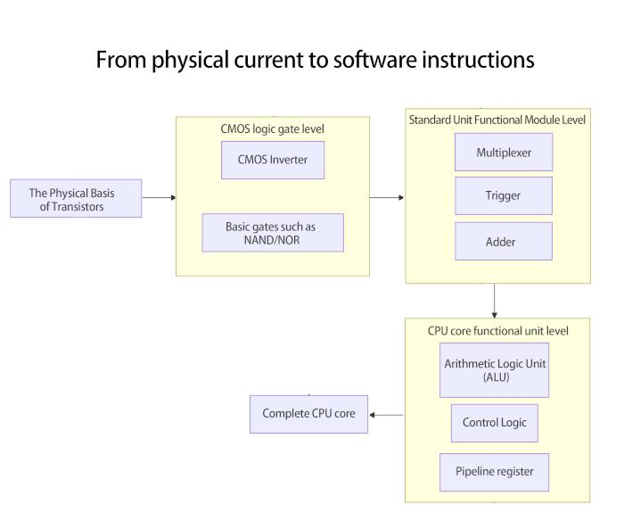

---

# What Is Digital Logic?

Digital electronics works with only two states.

| Binary | Meaning | Typical Voltage |
|---------|---------|-----------------|
| 0 | OFF / False / Low | Near 0 V |
| 1 | ON / True / High | Depends on technology (for example, around 3.3 V or 5 V in many systems) |

Instead of understanding words or numbers directly, a computer understands only these two states.

Logic gates process these binary values.

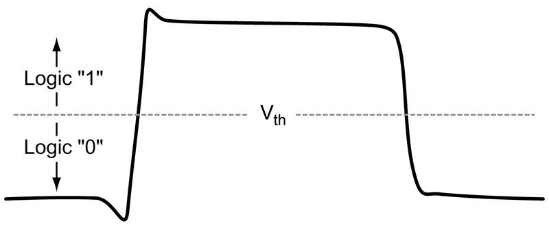

---

# Inputs and Outputs

Every logic gate receives one or more **inputs** and produces one **output**.

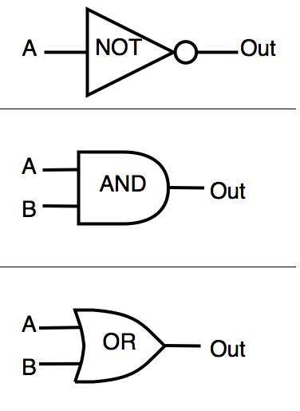

Some gates have one input.

Others have two or more.

---

# Truth Tables

A **truth table** lists every possible combination of inputs and the corresponding output.

For a gate with two inputs:

| A | B |
|---|---|
| 0 | 0 |
| 0 | 1 |
| 1 | 0 |
| 1 | 1 |

Each logic gate follows its own rule for producing the output.

---

# The Basic Logic Gates

The most common logic gates are:

- AND
- OR
- NOT
- NAND
- NOR
- XOR

Some textbooks also include **XNOR**, which is the opposite of XOR.

## Categories of Logic Gates

| Category | Gates |
|----------|-------|
| **Basic Gates** | AND, OR, NOT |
| **Universal Gates** | NAND, NOR |
| **Special-Purpose Gates** | XOR, XNOR |

### 1. Basic Gates
These are the fundamental building blocks of digital logic.

- **AND Gate** – Outputs HIGH (1) only when **all** inputs are HIGH.
- **OR Gate** – Outputs HIGH (1) if **at least one** input is HIGH.
- **NOT Gate** – Inverts the input (0 becomes 1, and 1 becomes 0).

### 2. Universal Gates
These gates are called **universal** because **any digital logic circuit** can be built using only one type of these gates.

- **NAND Gate** – Combination of an AND gate followed by a NOT gate.
- **NOR Gate** – Combination of an OR gate followed by a NOT gate.

> **Note:** NAND and NOR are the most commonly used gates in digital integrated circuits (ICs).

### 3. Special-Purpose Gates
These gates are designed for specific logical operations.

- **XOR (Exclusive OR)** – Outputs HIGH (1) only when the inputs are **different**.
- **XNOR (Exclusive NOR)** – Outputs HIGH (1) only when the inputs are **the same**.

---

### Summary

| Category | Purpose |
|----------|---------|
| **Basic Gates** | Perform fundamental logical operations. |
| **Universal Gates** | Can implement any digital circuit. |
| **Special-Purpose Gates** | Used for comparison, parity checking, and arithmetic circuits. |

---

# AND Gate

An **AND gate** produces an output of **1 only if every input is 1**.

Think of a secure door with two locks.

Both keys must be turned before the door opens.

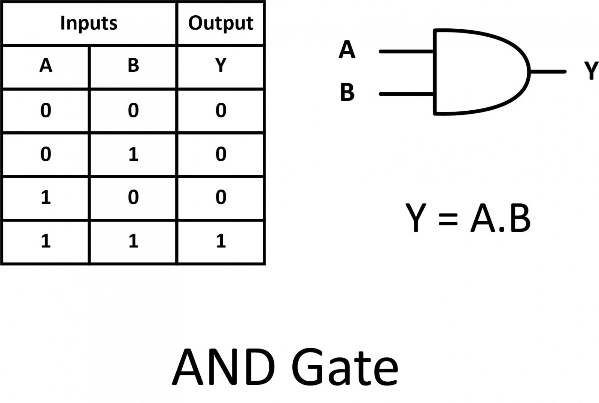
### Real-World Example

A laptop starts only if:

- The power button is pressed **AND**
- The battery has enough charge.

## Memory Trick

### AND = **All**

Think of **AND** as **All**.

- **All** required inputs must be **1 (HIGH)** before the output becomes **1 (HIGH)**.
- If **any one input is 0 (LOW)**, the output is **0 (LOW)**.
---

# OR Gate

An **OR gate** produces an output of **1 if at least one input is 1**.

Imagine a room with two light switches connected so that either one can turn on the light.

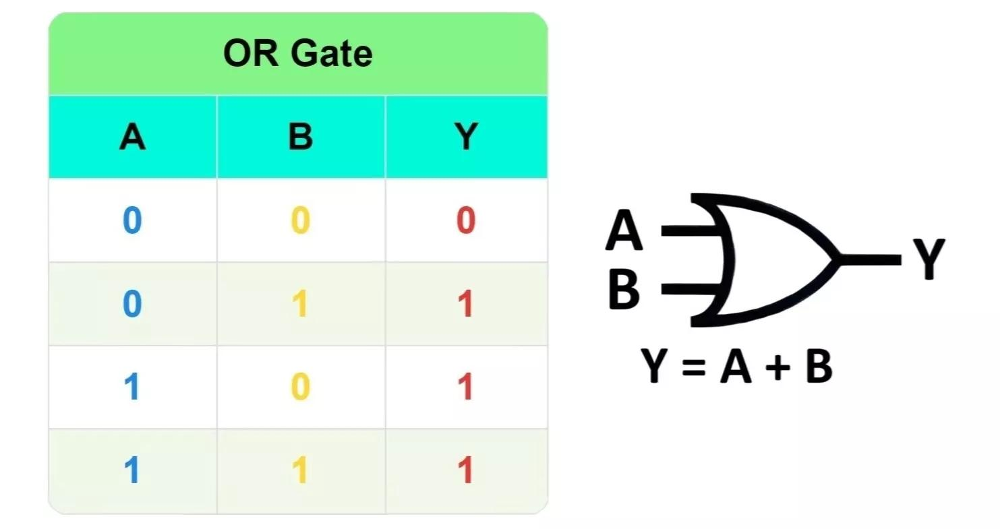
### Real-World Example

A computer wakes up if:

- A keyboard key is pressed **OR**
- The mouse is moved.


## Memory Trick

### OR = **One or More**

Think of **OR** as **One or More**.

- **At least one** input must be **1 (HIGH)** for the output to become **1 (HIGH)**.
- The output is **0 (LOW)** only when **all inputs are 0 (LOW)**.

---
# NOT Gate

A **NOT gate** has only one input.

It reverses the input.

- 0 becomes 1.
- 1 becomes 0.

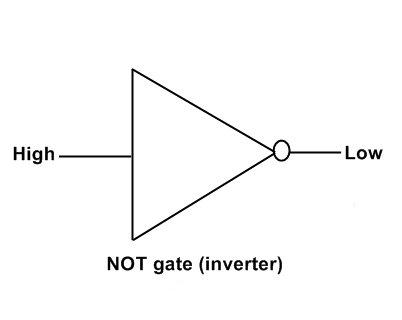

### Truth Table

| Input | Output |
|--------|--------|
| 0 | 1 |
| 1 | 0 |

### Real-World Example

If a sensor reports "Door Closed (1)," a NOT gate can produce "Door Open (0)."

---

# NAND Gate

A **NAND gate** is simply an AND gate followed by a NOT gate.

It gives the opposite result of AND.

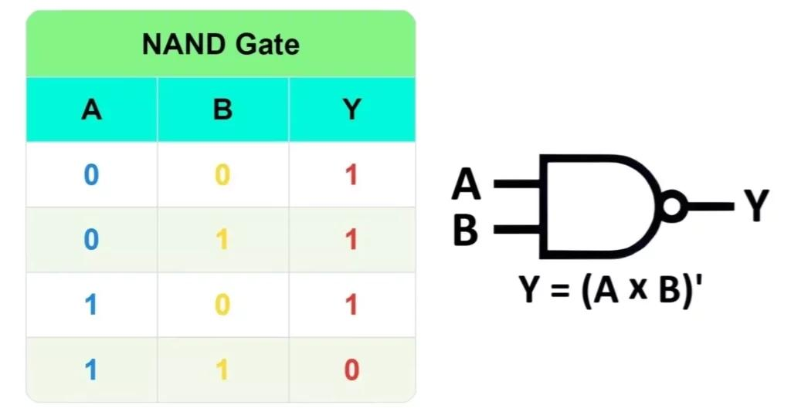
### Why Is NAND Important?

The NAND gate is called a **universal gate** because any digital circuit can be built using only NAND gates.

Many real processors are built primarily from NAND-based structures.

---

# NOR Gate

A **NOR gate** is an OR gate followed by a NOT gate.

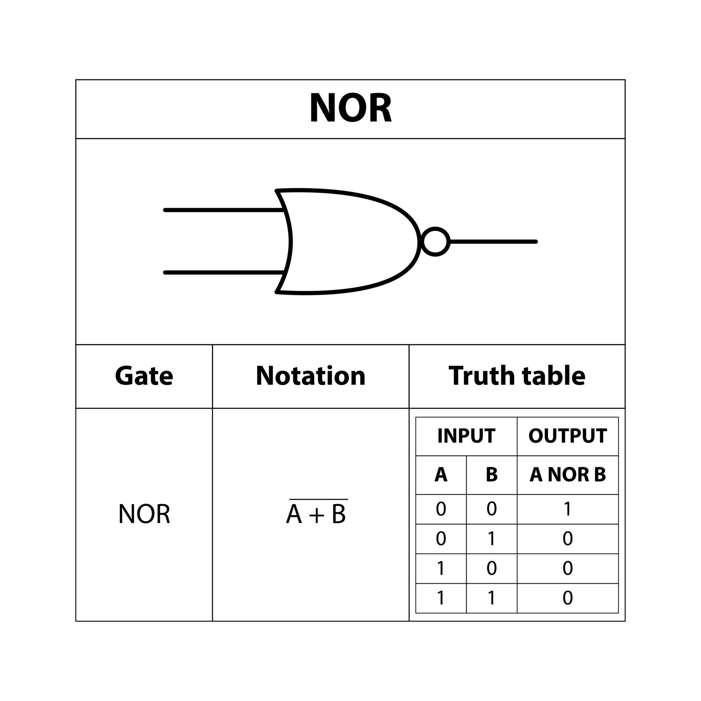

Like NAND, NOR is also a **universal gate**.

---

# XOR Gate

**XOR** stands for **Exclusive OR**.

It outputs **1 only when the inputs are different**.

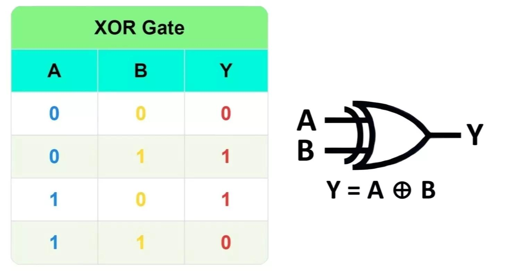
### Real-World Example

XOR is used in:

- Binary addition
- Error detection
- Cryptography
- Data comparison

---

# XNOR Gate (Optional but Common)

An **XNOR gate** is the opposite of XOR.

It outputs **1 when the inputs are the same**.

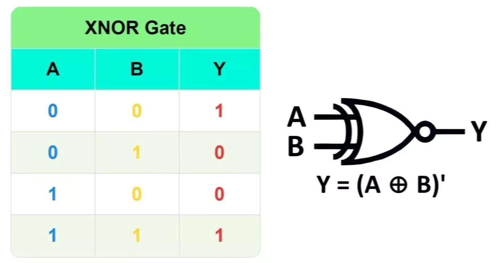

XNOR is commonly used in digital comparators.

---

# Summary of Logic Gates

| Gate | Output is 1 When... |
|------|----------------------|
| AND | All inputs are 1 |
| OR | At least one input is 1 |
| NOT | Input is inverted |
| NAND | NOT(AND) |
| NOR | NOT(OR) |
| XOR | Inputs are different |
| XNOR | Inputs are the same |

---

# How Transistors Build Logic Gates

A logic gate is not a single component.

It is a small circuit made from transistors.

For example:


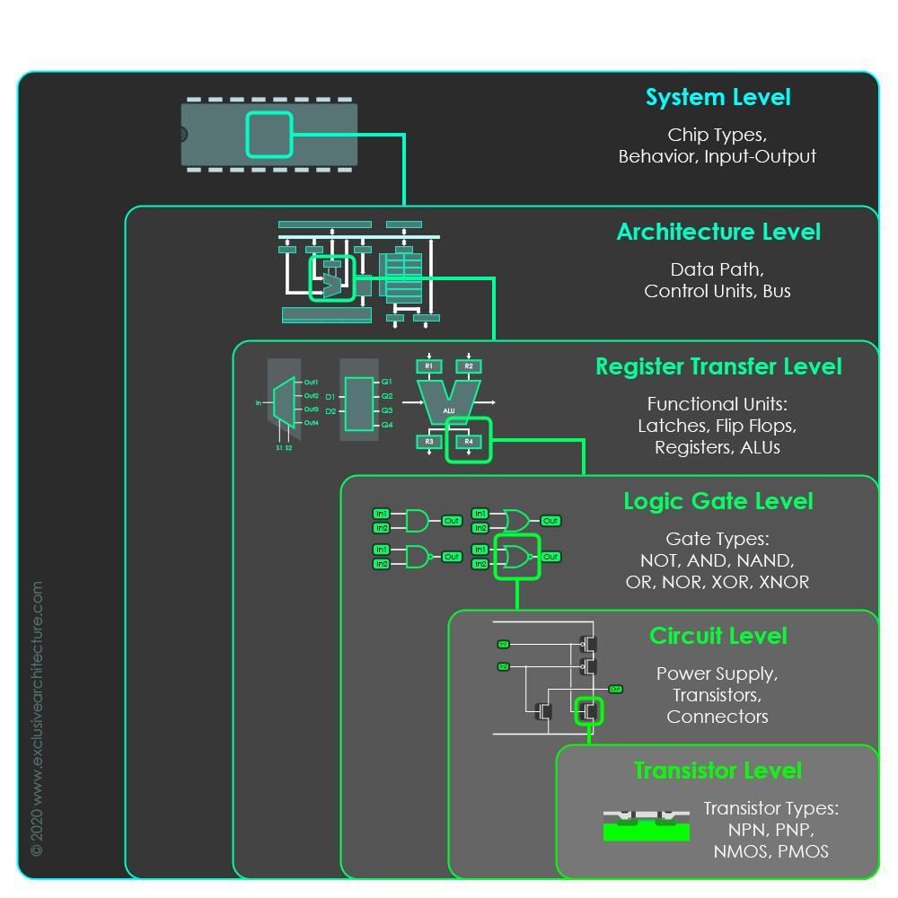


This layered design allows engineers to build incredibly complex systems from very simple building blocks.

---

# Where Logic Gates Are Used

Logic gates appear in almost every digital device.

Examples include:

- CPUs
- GPUs
- RAM
- SSD controllers
- Network routers
- Smartphones
- Washing machines
- Digital watches
- Game consoles
- Automotive control systems

Every digital decision is ultimately made by combinations of logic gates.

---

# Real-World Example: Automatic Door

Suppose an automatic door opens only if:

- A person is detected **AND**
- The door is unlocked.

```text
Motion Sensor ─┐
               │
               ▼
             AND Gate
               ▲
Door Unlock ───┘
               │
               ▼
          Open Door
```


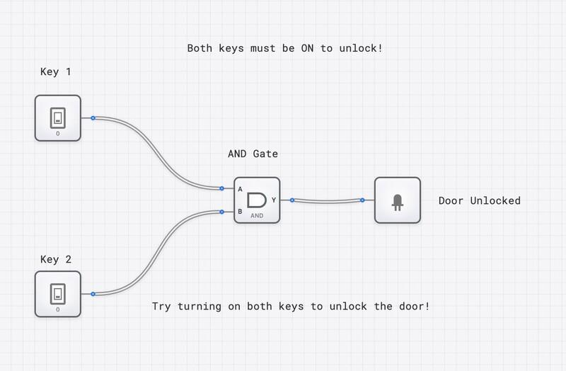

If either condition is false, the door stays closed.

---

# Common Misconceptions

### ❌ Logic gates understand numbers.

✅ Logic gates only process binary values (0 and 1).

---

### ❌ A logic gate is a physical switch.

✅ A logic gate is an electronic circuit built from transistors.

---

### ❌ CPUs use only one type of gate.

✅ Modern CPUs use millions or billions of different logic gates working together.

---

### ❌ XOR and OR are the same.

✅ OR outputs 1 if at least one input is 1. XOR outputs 1 only when the inputs are different.

---

# Summary

Logic gates are the basic decision-making circuits of digital electronics.

They receive binary inputs, apply logical rules, and produce binary outputs.

Using combinations of AND, OR, NOT, NAND, NOR, XOR, and XNOR gates, engineers build increasingly complex circuits such as adders, multiplexers, memory cells, ALUs, and entire CPUs.

Every modern computer depends on these simple yet powerful building blocks.

---

# Key Takeaways

- Logic gates process binary values (0 and 1).
- Inputs are processed to produce an output.
- Truth tables describe a gate's behavior.
- AND requires all inputs to be 1.
- OR requires at least one input to be 1.
- NOT inverts the input.
- NAND and NOR are universal gates.
- XOR detects differences between inputs.
- Logic gates are built from transistors.
- Billions of logic gates work together inside modern processors.

---

# Review Questions

1. What is a logic gate?
2. What are binary values?
3. What is the difference between an input and an output?
4. What is a truth table?
5. How does an AND gate work?
6. How does an OR gate differ from an XOR gate?
7. Why is the NOT gate unique?
8. Why are NAND and NOR called universal gates?
9. How are logic gates built?
10. Name three devices that use logic gates.

---

# Mini Quiz

### 1. Which gate outputs 1 only when **both** inputs are 1?

A. OR

B. XOR

C. AND

D. NOT

**Answer:** C

---

### 2. Which gate has only one input?

A. AND

B. OR

C. NOT

D. XOR

**Answer:** C

---

### 3. Which gate outputs 1 when the inputs are different?

A. NAND

B. XOR

C. NOR

D. AND

**Answer:** B

---

### 4. Which two gates are called **universal gates**?

A. AND and OR

B. XOR and XNOR

C. NAND and NOR

D. NOT and OR

**Answer:** C

---

### 5. Logic gates are primarily built from:

A. Batteries

B. Resistors

C. Transistors

D. Capacitors

**Answer:** C

---

# Further Reading

Now that you understand the basic logic gates, the next step is to learn the mathematical system used to describe and simplify their behavior.

This mathematical language is called **Boolean Algebra**. It allows engineers to design, analyze, and optimize digital circuits before building them in hardware.

---

# What's Next?

Logic gates allow computers to make simple decisions, but designing large digital circuits directly from truth tables quickly becomes difficult.

To solve this problem, engineers use **Boolean Algebra**—a mathematical system that represents logic using variables, operators, and rules.

In the next chapter, **Boolean Algebra**, we will learn how to write logical expressions, simplify circuits, and understand the mathematical foundation behind every digital computer.


➡️ **Next:** [09 Boolean Algebra](09_Boolean Algebra.md)