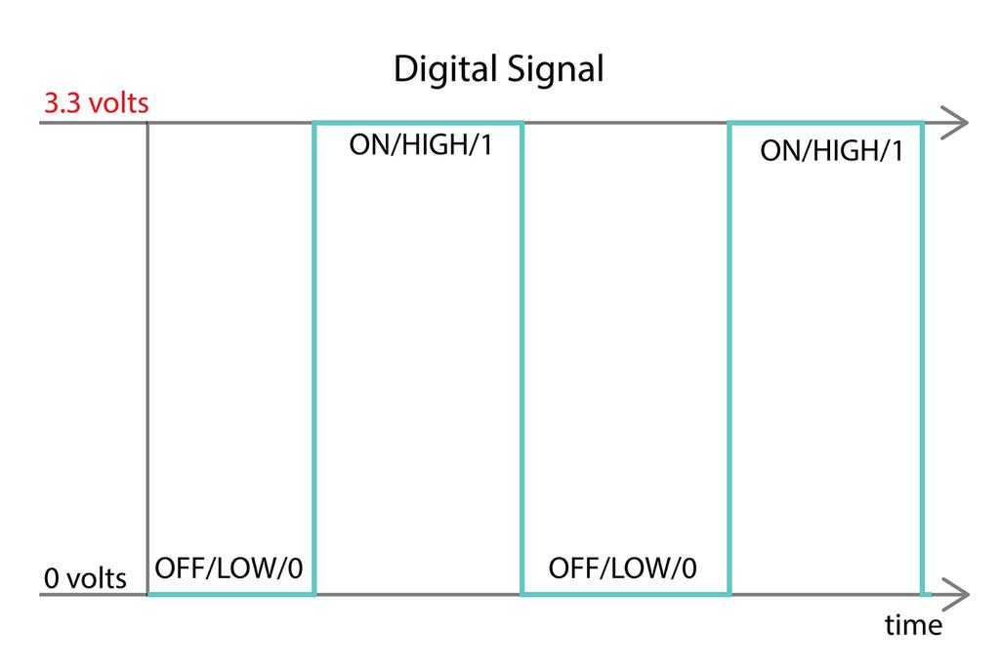
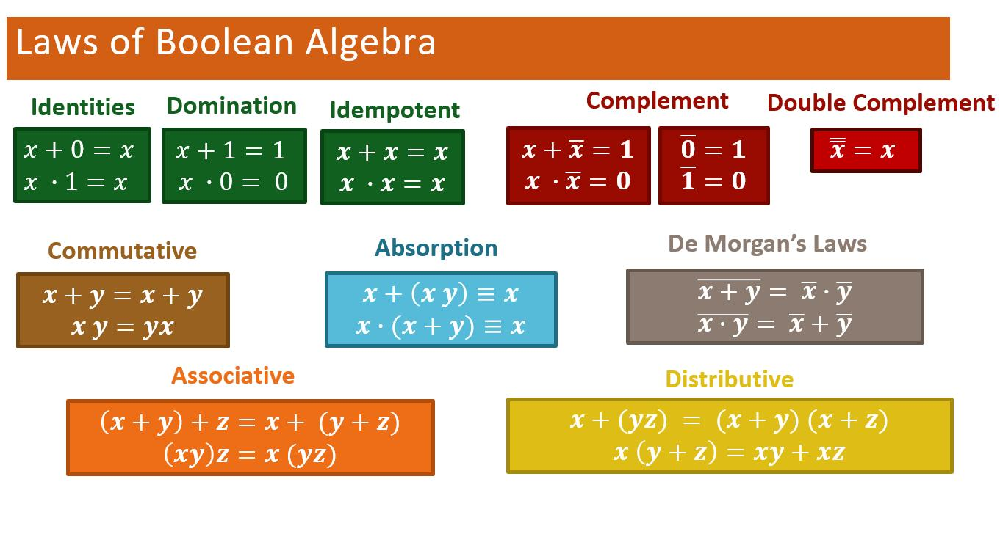
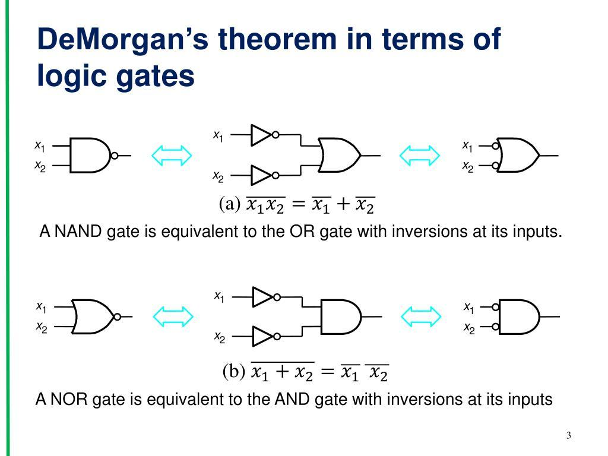

# Boolean Algebra

> *"Just as ordinary algebra is the language of mathematics, Boolean Algebra is the language of digital electronics."*

---

# Introduction

In the previous chapter, we learned about **logic gates** such as AND, OR, NOT, NAND, and XOR. These gates make simple decisions using binary values (0 and 1).

As digital circuits become more complex, describing them using only truth tables becomes difficult.

Imagine designing a CPU with billions of transistors by drawing truth tables for every circuit—it would be almost impossible.

Engineers solve this problem using **Boolean Algebra**.
---

## 💡 Did You Know?

Every instruction executed by a **CPU**—from opening a web browser to running an **AI model**—is ultimately reduced to **Boolean expressions** implemented using **logic gates**.

Before a chip is manufactured, **Electronic Design Automation (EDA)** software automatically performs **millions of Boolean optimizations** to:

- Reduce the number of logic gates
- Improve processing speed
- Lower power consumption
- Minimize chip area
- Increase overall efficiency and reliability

> **Fun Fact:** Modern processors contain **billions of transistors**, but their operation is still based on the same fundamental **Boolean logic** introduced by **George Boole** in the 19th century.

---

Boolean Algebra is a mathematical system for representing and simplifying logical operations. It allows engineers to describe, analyze, simplify, and optimize digital circuits before they are physically built.

Every modern processor, memory chip, graphics card, and embedded system relies on Boolean Algebra.

---

# Learning Objectives

After completing this lesson, you will be able to:

- Define Boolean Algebra.
- Understand Boolean variables and constants.
- Learn the three basic Boolean operations.
- Write Boolean expressions.
- Understand Boolean laws and identities.
- Simplify logical expressions.
- Understand why Boolean Algebra is essential for digital circuit design.

---

# Prerequisite Knowledge

Before reading this lesson, you should understand:

- Binary numbers (0 and 1)
- Logic gates
- Truth tables
- Inputs and outputs

---

# What Is Boolean Algebra?

**Boolean Algebra** is a branch of mathematics that deals with **logical values** instead of ordinary numbers.

Unlike normal algebra, which works with numbers such as:

```
2
15
100
3.14
```

Boolean Algebra works with only two values:

```
0
1
```

These values represent:

| Boolean Value | Meaning |
|---------------|---------|
| 0 | False, OFF, Low Voltage |
| 1 | True, ON, High Voltage |

Boolean Algebra was developed by the English mathematician **George Boole** in the 19th century. Although it was originally a mathematical theory, it later became the foundation of digital electronics and computer engineering.

---

# Why Do Computers Use Boolean Algebra?

Computers are electronic devices.

Electronic circuits can easily represent two stable states:


Because electronic hardware naturally works with two states, Boolean Algebra is the perfect mathematical language for describing digital circuits.

---

# Boolean Variables

A **Boolean variable** is a variable that can have only one of two values:

```
0

or

1
```

Variables are usually represented by letters.

Examples:

```
A

B

C

X

Y
```

If:

```
A = 1

B = 0
```

then A is TRUE and B is FALSE.

---

# Boolean Constants

Boolean Algebra has only two constants.

| Constant | Meaning |
|----------|---------|
| 0 | False |
| 1 | True |

Unlike ordinary mathematics, there are no values between 0 and 1.

---

# The Three Basic Boolean Operations

All digital circuits are built from three fundamental operations:

1. AND
2. OR
3. NOT

Every other logic gate can be derived from these operations.

---

# AND Operation

The AND operation produces 1 only if **all inputs are 1**.

Boolean notation:

```
A · B
```

Sometimes written as:

```
AB
```

### Truth Table

| A | B | A AND B |
|---|---|----------|
| 0 | 0 | 0 |
| 0 | 1 | 0 |
| 1 | 0 | 0 |
| 1 | 1 | 1 |

Example:

```
Door Opens

Only if

Key 1 = ON

AND

Key 2 = ON
```

---

# OR Operation

The OR operation produces 1 if **at least one input is 1**.

Boolean notation:

```
A + B
```

### Truth Table

| A | B | A OR B |
|---|---|---------|
| 0 | 0 | 0 |
| 0 | 1 | 1 |
| 1 | 0 | 1 |
| 1 | 1 | 1 |

Example:

```
Alarm sounds if

Door Opens

OR

Window Opens
```

---

# NOT Operation

The NOT operation reverses a value.

```
1 → 0

0 → 1
```

Boolean notation:

```
A̅

or

NOT A
```

### Truth Table

| A | NOT A |
|---|-------|
| 0 | 1 |
| 1 | 0 |

---

# Building Boolean Expressions

Logic circuits can be written as mathematical expressions.

Example:

```
(A AND B) OR C
```

Boolean notation:

```
(A · B) + C
```

Example:

Suppose:

```
A = 1

B = 0

C = 1
```

Step 1

```
A · B

1 · 0 = 0
```

Step 2

```
0 + 1 = 1
```

Final Output:

```
1
```

---

# Relationship Between Logic Gates and Boolean Algebra

Each logic gate has a matching Boolean operation.

| Logic Gate | Boolean Symbol |
|------------|----------------|
| AND | A · B |
| OR | A + B |
| NOT | A̅ |
| NAND | (A · B)̅ |
| NOR | (A + B)̅ |
| XOR | A ⊕ B |

This allows engineers to move easily between circuit diagrams and mathematical expressions.

---

# Boolean Laws

Boolean Algebra includes a set of laws that simplify logic expressions.

These laws help reduce the number of logic gates required to build a circuit.

Fewer gates mean:

- Smaller chips
- Lower power consumption
- Faster circuits
- Lower manufacturing cost

---

# Identity Law

Adding 0 or ANDing with 1 does not change the value.

| Expression | Result |
|------------|--------|
| A + 0 | A |
| A · 1 | A |

Example:

```
1 + 0 = 1

0 · 1 = 0
```

---

# Null (Domination) Law

| Expression | Result |
|------------|--------|
| A + 1 | 1 |
| A · 0 | 0 |

Example:

```
0 + 1 = 1

1 · 0 = 0
```

---

# Idempotent Law

Using the same variable twice has no additional effect.

| Expression | Result |
|------------|--------|
| A + A | A |
| A · A | A |

---

# Complement Law

A variable combined with its complement produces a constant.

| Expression | Result |
|------------|--------|
| A + A̅ | 1 |
| A · A̅ | 0 |

Example:

If A = 1

```
1 + 0 = 1

1 · 0 = 0
```

---

# Double Negation Law

Applying NOT twice returns the original value.

```
NOT(NOT(A))

=

A
```

Example:

```
NOT(NOT(1))

=

1
```

---

# Commutative Law

The order of variables does not matter.

| Expression | Equivalent Expression |
|------------|-----------------------|
| A + B | B + A |
| A · B | B · A |

---

# Associative Law

Grouping does not change the result.

| Expression | Equivalent Expression |
|------------|-----------------------|
| (A + B) + C | A + (B + C) |
| (A · B) · C | A · (B · C) |

---

# Distributive Law

Similar to ordinary algebra.

| Expression | Equivalent Expression |
|------------|-----------------------|
| A(B + C) | AB + AC |
| A + BC | (A + B)(A + C) |

This law is frequently used to simplify logic circuits.




---

# De Morgan's Theorems

De Morgan's Theorems are among the most important rules in digital electronics.

They allow engineers to replace AND gates with OR gates (and vice versa) while applying NOT operations.

| Expression | Equivalent Expression |
|------------|-----------------------|
| (A · B)̅ | A̅ + B̅ |
| (A + B)̅ | A̅ · B̅ |

These theorems are widely used when designing circuits with NAND and NOR gates.





---

# Simplifying Boolean Expressions

Suppose we have:

```
A · 1
```

Using the Identity Law:

```
A · 1 = A
```

Another example:

```
A + A
```

Using the Idempotent Law:

```
A + A = A
```

Simplification reduces the number of gates required in hardware.

---

# Why Simplification Matters

Imagine two circuit designs.

### Circuit 1

```
10 Logic Gates
```

### Circuit 2

```
6 Logic Gates
```

If both perform the same task, engineers choose the second design because it:

- Costs less
- Uses less power
- Occupies less chip area
- Operates faster
- Generates less heat

This is why Boolean Algebra is such a powerful engineering tool.

---

# Real-World Applications

Boolean Algebra is used in:

- CPU design
- GPU design
- ALU design
- Memory circuits
- Digital communication systems
- Embedded systems
- FPGA programming
- Microcontrollers
- Digital signal processing
- Error detection circuits

Every digital integrated circuit is designed using Boolean expressions.

---

# Common Misconceptions

### ❌ Boolean Algebra is the same as ordinary algebra.

✅ Boolean Algebra uses only two values: 0 and 1.

---

### ❌ Boolean Algebra is only theoretical.

✅ Every digital circuit in modern computers is based on Boolean Algebra.

---

### ❌ Logic gates and Boolean Algebra are different topics.

✅ Logic gates are the hardware implementation of Boolean Algebra.

---

### ❌ Simplification only makes equations shorter.

✅ Simplification also reduces hardware complexity, cost, power consumption, and chip area.

---

# Summary

Boolean Algebra is the mathematical foundation of digital electronics.

It uses only two values—0 and 1—to represent logical states.

Using Boolean operators and laws, engineers can describe and simplify digital circuits before building them with logic gates and transistors.

This mathematical approach makes modern processors, memory, and digital systems practical and efficient.

---

# Key Takeaways

- Boolean Algebra works with binary values (0 and 1).
- Boolean variables represent logical states.
- AND, OR, and NOT are the basic Boolean operations.
- Logic gates directly implement Boolean expressions.
- Boolean laws simplify digital circuits.
- De Morgan's Theorems are fundamental for circuit design.
- Simplifying expressions reduces hardware complexity.
- Boolean Algebra is the mathematical language of digital electronics.

---

# Review Questions

1. What is Boolean Algebra?
2. Why do computers use Boolean Algebra?
3. What are Boolean variables?
4. What are the three basic Boolean operations?
5. How is an AND operation represented?
6. What is the Complement Law?
7. What is the Double Negation Law?
8. Why are De Morgan's Theorems important?
9. Why do engineers simplify Boolean expressions?
10. How are Boolean Algebra and logic gates related?

---

# Mini Quiz

### 1. Boolean Algebra uses which values?

A. -1 and 1

B. 0 and 10

C. 0 and 1

D. Any integer

**Answer:** C

---

### 2. Which Boolean operation is represented by the symbol **+**?

A. AND

B. OR

C. NOT

D. XOR

**Answer:** B

---

### 3. Which law states that **A + A = A**?

A. Identity Law

B. Idempotent Law

C. Complement Law

D. Associative Law

**Answer:** B

---

### 4. Which theorem is commonly used to convert AND operations into OR operations with inverted inputs?

A. Pythagorean Theorem

B. Boolean Identity

C. De Morgan's Theorem

D. Commutative Law

**Answer:** C

---

### 5. Why is Boolean simplification important?

A. It increases the number of gates.

B. It reduces hardware complexity and improves efficiency.

C. It changes binary numbers into decimal numbers.

D. It eliminates transistors.

**Answer:** B

---

# Further Reading

Now that you understand the mathematical language of digital logic, the next step is to see how logic gates are combined to perform useful operations.

Instead of studying individual gates, we will begin building complete digital circuits that perform arithmetic, selection, and data processing.

---

# What's Next?

A single logic gate can make a simple decision, but real computers perform complex tasks such as addition, comparison, data selection, and decoding.

These functions are created by combining multiple logic gates into larger circuits called **Combinational Circuits**.

In the next chapter, **Combinational Circuits**, we will build practical digital components such as **half adders, full adders, multiplexers, demultiplexers, encoders, decoders, and comparators**—the building blocks of every Arithmetic Logic Unit (ALU) and CPU.


➡️ **Next:** [10 Combinational Circuits](10_Combinational Circuits.md)