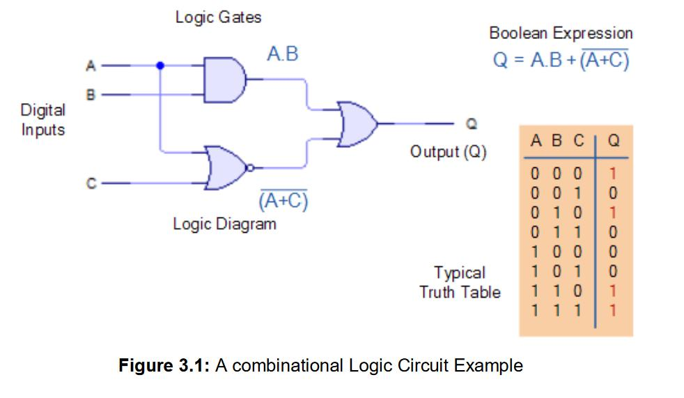

# Combinational Circuits

> *"A single logic gate can make a simple decision. A combinational circuit combines many gates to solve real computational problems."*

---

# Introduction

In the previous chapter, we learned that **Boolean Algebra** provides the mathematical foundation for digital logic. We also learned how **logic gates** implement Boolean expressions in hardware.

However, a modern computer does much more than evaluate simple logical conditions.

A processor must:

- Add numbers
- Compare values
- Select data
- Convert binary codes
- Route information between components

A single logic gate cannot perform these complex tasks.

Instead, engineers combine multiple logic gates into larger circuits called **combinational circuits**.

These circuits form the first level of complexity in digital system design and are used throughout every CPU, GPU, memory controller, and embedded system.

---

# Learning Objectives

After completing this lesson, you will be able to:

- Define a combinational circuit.
- Understand how combinational circuits differ from sequential circuits.
- Explain the relationship between logic gates and combinational circuits.
- Understand the operation of:
  - Half Adder
  - Full Adder
  - Multiplexer (MUX)
  - Demultiplexer (DEMUX)
  - Encoder
  - Decoder
  - Comparator
- Recognize where these circuits are used inside modern computers.

---

# Prerequisite Knowledge

Before reading this lesson, you should understand:

- Binary numbers
- Boolean Algebra
- Logic gates
- Truth tables

---

# What Is a Combinational Circuit?

A **combinational circuit** is a digital circuit whose **output depends only on the current input values**.

It does **not remember** previous inputs.

In other words:

```
Current Inputs
       │
       ▼
Combinational Circuit
       │
       ▼
Current Output
```


If the inputs change, the output changes immediately (after a very small propagation delay).

---

# Characteristics of Combinational Circuits

A combinational circuit:

- Uses logic gates.
- Has no memory.
- Has no feedback loops.
- Produces outputs based only on present inputs.
- Is described by Boolean expressions and truth tables.

---

# Combinational vs Sequential Circuits

| Feature | Combinational Circuit | Sequential Circuit |
|----------|----------------------|--------------------|
| Depends on Current Inputs | ✅ Yes | ✅ Yes |
| Depends on Previous Inputs | ❌ No | ✅ Yes |
| Memory | ❌ No | ✅ Yes |
| Clock Required | Usually No | Usually Yes |
| Examples | Adders, Multiplexers | Registers, Counters |

We will study **sequential circuits** in the next chapter.

---

# Building Combinational Circuits

Every combinational circuit is built from logic gates.

```
Transistors
      │
      ▼
Logic Gates
      │
      ▼
Combinational Circuits
      │
      ▼
ALU
      │
      ▼
CPU
```


This layered design allows engineers to create increasingly powerful digital systems.

---

# Half Adder

A **Half Adder** adds **two single-bit binary numbers**.

Inputs:

- A
- B

Outputs:

- Sum (S)
- Carry (C)

### Block Diagram

```text
A ───┐
     │
     ▼
 Half Adder
     │
     ├──► Sum
     │
     └──► Carry
B ───┘
```

### Truth Table

| A | B | Sum | Carry |
|---|---|-----|-------|
| 0 | 0 | 0 | 0 |
| 0 | 1 | 1 | 0 |
| 1 | 0 | 1 | 0 |
| 1 | 1 | 0 | 1 |

### Boolean Expressions

```
Sum = A ⊕ B
Carry = A · B
```

### Limitation

A Half Adder cannot add a **carry input** from a previous addition.

---

# Full Adder

A **Full Adder** solves the limitation of the Half Adder.

It adds:

- A
- B
- Carry Input (Cin)

Outputs:

- Sum
- Carry Output (Cout)

### Block Diagram


### Truth Table

| A | B | Cin | Sum | Cout |
|---|---|-----|-----|------|
|0|0|0|0|0|
|0|0|1|1|0|
|0|1|0|1|0|
|0|1|1|0|1|
|1|0|0|1|0|
|1|0|1|0|1|
|1|1|0|0|1|
|1|1|1|1|1|

### Why Is It Important?

Multiple Full Adders can be connected together to create:

- 4-bit adders
- 8-bit adders
- 16-bit adders
- 32-bit adders
- 64-bit adders

Every processor performs arithmetic using Full Adders.

---

# Multiplexer (MUX)

A **Multiplexer** selects **one input from many inputs** and sends it to a single output.

It is often called a **data selector**.

### Example: 4-to-1 Multiplexer


### Real-World Analogy

Imagine a railway junction.

Several tracks enter the junction, but only one train is allowed to continue onto the main track at a time.

The select lines decide which track is connected.

### Applications

- CPU datapaths
- Bus selection
- Memory access
- Data routing

---

# Demultiplexer (DEMUX)

A **Demultiplexer** performs the opposite function of a multiplexer.

It sends **one input** to **one of many outputs**.

### Diagram

### Applications

- Memory selection
- Device control
- Signal distribution

---

# Encoder

An **Encoder** converts **multiple input lines into a binary code**.

### Example

```text
Input 4 Active

↓

Output

100
```

### Example: 8-to-3 Encoder

```
8 Inputs

↓

3 Output Bits
```

### Applications

- Keyboard controllers
- Interrupt systems
- Digital communication

---

# Decoder

A **Decoder** performs the opposite operation.

It converts **binary input into multiple output lines**.

### Example


## Why Decoders Are Important

A **decoder** converts an **n-bit binary input** into one of **2ⁿ unique outputs**, allowing a digital system to select exactly one device or operation at a time.

Processors use decoders to:

- **Decode machine instructions** into the required control signals.
- **Select memory locations** during memory read and write operations.
- **Enable registers** so that only the selected register is accessed.
- **Activate specific hardware blocks** such as the ALU, memory, input/output (I/O) devices, or control circuits.

> **Key Idea:** A decoder acts like a **digital selector**—it takes a binary code as input and activates **only one corresponding output**, ensuring that the correct hardware component responds.

### Applications

- Memory addressing
- Display control
- Instruction decoding
- Chip selection

---

# Comparator

A **Comparator** compares two binary numbers.

It determines whether:

- A > B
- A < B
- A = B

### Block Diagram


### Applications

- CPUs
- Sorting circuits
- Arithmetic units
- Decision-making circuits

---

# How These Circuits Work Together

A processor combines many combinational circuits.

```text
Logic Gates
      │
      ▼
Half Adders
      │
      ▼
Full Adders
      │
      ▼
Arithmetic Logic Unit (ALU)
      │
      ▼
CPU
```

At the same time:

```text
MUX

↓

Select Data

↓

Registers

↓

ALU

↓

Output
```

And:

```text
Decoder

↓

Choose Memory Location

↓

Read or Write Data
```

Together, these circuits perform the core operations of a computer.

---

# Real-World Applications

Combinational circuits are found in:

- CPUs
- GPUs
- RAM controllers
- SSD controllers
- Embedded systems
- Mobile processors
- Digital calculators
- Network routers
- Automotive electronics
- FPGA designs

Every digital device contains thousands to billions of combinational circuits.

---

# Common Misconceptions

### ❌ Combinational circuits can remember previous inputs.

✅ They have no memory. Outputs depend only on current inputs.

---

### ❌ A Half Adder can perform all binary addition.

✅ A Half Adder cannot process a carry input. Full Adders are required for multi-bit arithmetic.

---

### ❌ Multiplexers store data.

✅ Multiplexers only select which input is connected to the output.

---

### ❌ Decoders and encoders perform the same task.

✅ They perform opposite operations.

---

# Summary

Combinational circuits combine multiple logic gates to perform useful digital operations.

Unlike individual gates, these circuits solve practical problems such as addition, data selection, comparison, and binary encoding.

Important combinational circuits include:

- Half Adders
- Full Adders
- Multiplexers
- Demultiplexers
- Encoders
- Decoders
- Comparators

These components are fundamental building blocks of the Arithmetic Logic Unit (ALU), memory systems, and processor datapaths.

---

# Key Takeaways

- Combinational circuits have no memory.
- Outputs depend only on current inputs.
- Half Adders add two single bits.
- Full Adders include a carry input.
- Multiplexers select one input from many.
- Demultiplexers route one input to one output.
- Encoders convert many inputs into binary codes.
- Decoders convert binary codes into individual outputs.
- Comparators compare binary values.
- Modern processors rely heavily on combinational circuits.

---

# Review Questions

1. What is a combinational circuit?
2. How does it differ from a sequential circuit?
3. What is the purpose of a Half Adder?
4. Why is a Full Adder more useful than a Half Adder?
5. What is a multiplexer?
6. What is a demultiplexer?
7. What is an encoder?
8. What is a decoder?
9. What is a comparator?
10. Where are combinational circuits used in a CPU?

---

# Mini Quiz

### 1. A combinational circuit depends on:

A. Previous inputs

B. Current inputs only

C. The system clock only

D. Stored memory

**Answer:** B

---

### 2. Which circuit adds two bits and a carry input?

A. Half Adder

B. Comparator

C. Full Adder

D. Decoder

**Answer:** C

---

### 3. Which circuit selects one input from many inputs?

A. Decoder

B. Multiplexer

C. Encoder

D. Comparator

**Answer:** B

---

### 4. Which circuit converts binary input into multiple output lines?

A. Encoder

B. Decoder

C. Full Adder

D. XOR Gate

**Answer:** B

---

### 5. Which circuit compares two binary numbers?

A. Multiplexer

B. Comparator

C. Half Adder

D. NAND Gate

**Answer:** B

---

# Further Reading

Combinational circuits perform calculations based only on present inputs, but computers also need to **remember** information. A processor must store intermediate results, instructions, addresses, and data while executing programs.

To achieve this, digital systems use **Sequential Circuits**, which introduce the concept of **memory** and often operate with the help of a **clock signal**.

---

# What's Next?

So far, every circuit we have studied immediately responds to its inputs and then "forgets" the result.

Modern computers, however, need to remember values over time. This is made possible by **Sequential Circuits**, which combine logic gates with feedback and storage elements.

In the next chapter, **Sequential Circuits**, we will explore **latches, flip-flops, registers, counters, and clock signals**—the essential components that allow computers to store data and execute programs step by step.


➡️ **Next:** [11 Sequential Circuits](11_Sequential Circuits.md)