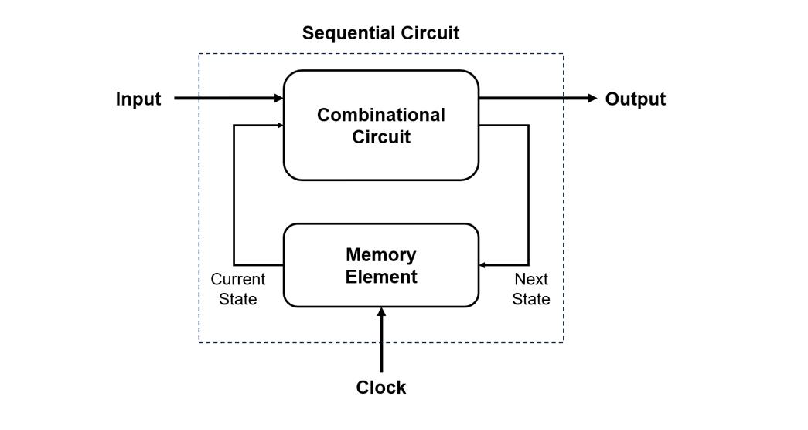
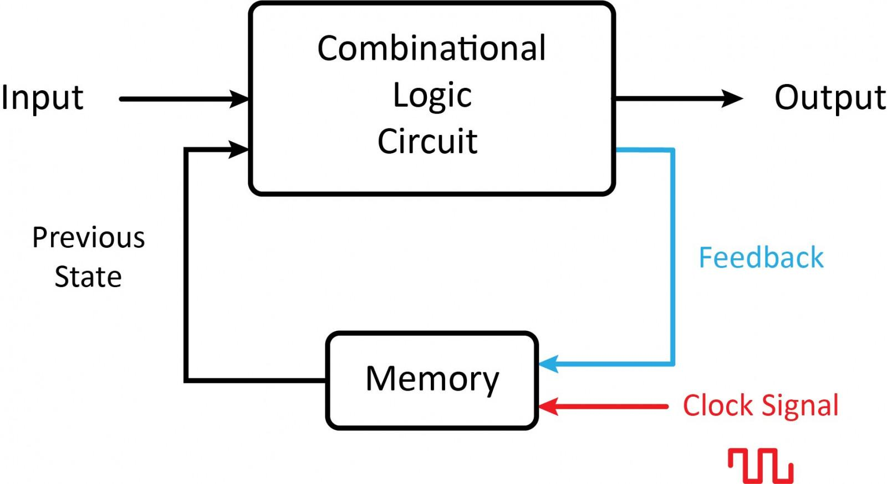
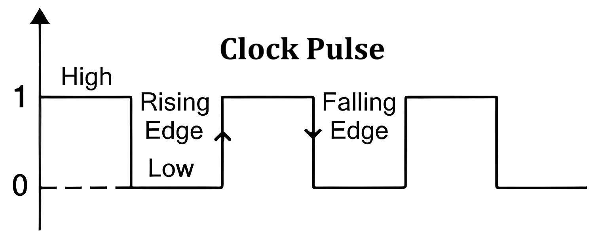
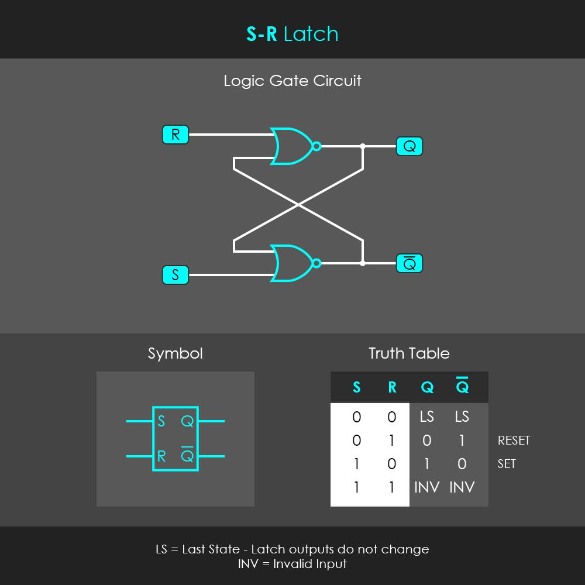
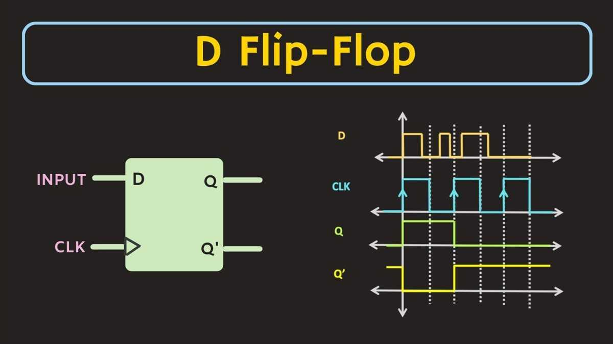
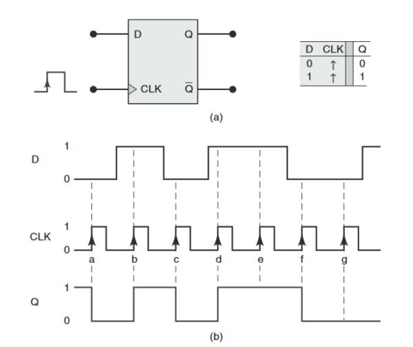
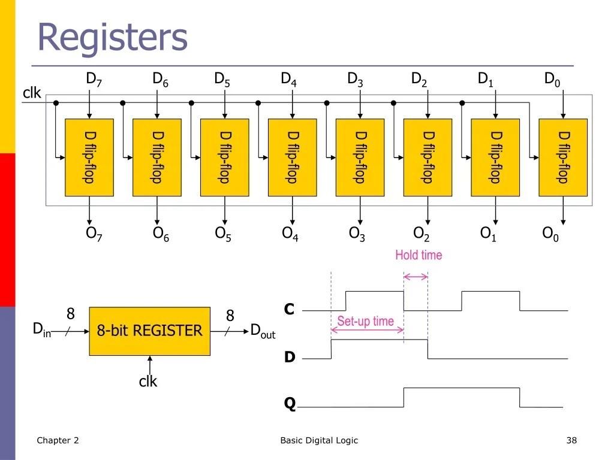

# Sequential Circuits

> *"A combinational circuit can calculate, but a sequential circuit can remember. Memory is what transforms simple digital logic into a real computer."*

---

# Introduction

In the previous chapter, we learned about **combinational circuits**. These circuits produce outputs based only on their **current inputs**.

However, a real computer must do much more than perform calculations.

A processor must remember:

- The current instruction being executed.
- The value of variables.
- The address of the next instruction.
- Intermediate calculation results.
- The current state of the system.

Without memory, every calculation would be forgotten immediately.

This is where **sequential circuits** become essential.

Unlike combinational circuits, sequential circuits **store information**. Their outputs depend not only on the current inputs but also on their **previous state**.

Sequential circuits make modern computing possible.

---

# Learning Objectives

After completing this lesson, you will be able to:

- Define a sequential circuit.
- Understand the concept of digital memory.
- Explain the role of feedback.
- Understand clock signals.
- Learn about latches and flip-flops.
- Understand registers and counters.
- Compare combinational and sequential circuits.
- Prepare for studying computer memory systems.

---

# Prerequisite Knowledge

Before reading this lesson, you should understand:

- Logic gates
- Boolean Algebra
- Combinational circuits
- Binary numbers

---

# What Is a Sequential Circuit?

A **sequential circuit** is a digital circuit whose **output depends on both**:

- The **current inputs**, and
- The **previous state** (stored information).

Unlike combinational circuits, sequential circuits have **memory**.



This ability to remember previous information is the defining feature of sequential circuits.

---

# Why Memory Is Important

Imagine solving a math problem without remembering any previous step.

You would have to start over every time.

A computer faces the same challenge.

For example, when adding two large numbers:

```
1258
+3749
------
```

The processor must remember the carry from one column while calculating the next.

Without memory, multi-step calculations would not be possible.

---

# Characteristics of Sequential Circuits

A sequential circuit:

- Stores information.
- Has memory.
- Often uses a clock signal.
- May contain feedback paths.
- Depends on both present inputs and previous outputs.

---

# Combinational vs Sequential Circuits

| Feature | Combinational Circuit | Sequential Circuit |
|----------|----------------------|--------------------|
| Memory | ❌ No | ✅ Yes |
| Depends on Current Inputs | ✅ Yes | ✅ Yes |
| Depends on Previous State | ❌ No | ✅ Yes |
| Feedback | ❌ No | ✅ Yes |
| Clock | Usually No | Usually Yes |
| Examples | Adders, MUX | Flip-Flops, Registers |

---

# Feedback

A sequential circuit stores information by feeding part of its output back into its input.



This feedback allows the circuit to "remember" a previous value.

---

# What Is a Clock Signal?

Most sequential circuits use a **clock signal**.

A **clock** is a repeating electrical pulse that synchronizes operations inside a digital system.



Each transition of the clock tells circuits **when** to update their stored values.

Think of a conductor leading an orchestra.

Each musician waits for the conductor's signal before playing.

Similarly, digital circuits wait for the clock before changing state.

---

# Why Use a Clock?

Without synchronization:

- Different circuits could change at different times.
- Incorrect data might be read.
- Complex processors would become unreliable.

The clock keeps every part of the processor working together.

---

# Clock Cycle

A **clock cycle** is one complete repetition of the clock waveform.


During each cycle, a processor may:

- Read data.
- Perform calculations.
- Store results.
- Fetch the next instruction.

---

# Latches

A **latch** is the simplest sequential memory element.

It can store **one bit** of information.

```
0

or

1
```

Once a value is stored, it remains until it is changed.

---

# SR Latch

One common latch is the **SR (Set-Reset) Latch**.

Inputs:

- Set (S)
- Reset (R)

Outputs:

- Q
- Q̅ (the opposite of Q)

### Simplified Block Diagram




Operation:

- **Set = 1** → Store 1.
- **Reset = 1** → Store 0.
- Otherwise, retain the previous value.

---

# Flip-Flops

A **flip-flop** is an improved memory element that usually changes state only on a clock edge.

Like a latch, it stores **one bit**.

Unlike many latches, a flip-flop is synchronized by the clock, making it more suitable for modern digital systems.

---

# D Flip-Flop

The most commonly used flip-flop is the **D (Data) Flip-Flop**.

Inputs:

- D (Data)
- Clock

Output:

- Q

### Block Diagram




When the clock edge occurs, the value at **D** is copied to **Q**.

---

# Timing Example




The output changes only when the clock triggers it.

---

# Registers

A **register** is a group of flip-flops used to store multiple bits.

Example:




```text
Bit7 Bit6 Bit5 Bit4 Bit3 Bit2 Bit1 Bit0
```

Registers are much faster than main memory and are located inside the CPU.

---

# Uses of Registers

Registers store:

- Operands for calculations.
- Instruction addresses.
- Memory addresses.
- Temporary data.
- CPU status information.

Examples include:

- Program Counter (PC)
- Instruction Register (IR)
- Accumulator
- General-Purpose Registers

---

# Counters

A **counter** is a sequential circuit that counts clock pulses.

Example:

```text
Clock Pulses

↓

0

↓

1

↓

2

↓

3

↓

4
```

Counters are widely used in:

- Timers
- Digital clocks
- Frequency measurement
- Program sequencing
- Event counting

---

# Finite State Machines (FSMs)

Many sequential circuits are designed as **Finite State Machines (FSMs)**.

An FSM changes between a limited number of states based on inputs and the current state.

Example:

```text
OFF

↓

STARTING

↓

RUNNING

↓

STOPPED
```

Modern processors use FSMs to control instruction execution and hardware operations.

---

# How Sequential Circuits Build a Computer

Sequential circuits form the storage and control elements of a computer.

```text
Logic Gates
      │
      ▼
Combinational Circuits
      │
      ▼
Flip-Flops
      │
      ▼
Registers
      │
      ▼
Control Unit
      │
      ▼
CPU
```

Without sequential circuits, a processor could calculate but could never remember results.

---

# Real-World Applications

Sequential circuits are used in:

- CPU registers
- Cache memory
- Program counters
- Digital clocks
- Memory controllers
- Keyboard controllers
- Communication systems
- Microcontrollers
- Embedded systems
- Robotics

Nearly every digital device contains millions or billions of sequential circuits.

---

# Common Misconceptions

### ❌ Sequential circuits are just larger combinational circuits.

✅ Sequential circuits include memory and often feedback, allowing them to remember previous states.

---

### ❌ Every sequential circuit requires a clock.

✅ Many do, but some (such as certain asynchronous circuits and latches) can operate without a global clock.

---

### ❌ Registers are the same as RAM.

✅ Registers are small, extremely fast storage locations inside the CPU. RAM is much larger but slower and located outside the CPU core.

---

### ❌ Flip-flops store many bits.

✅ A single flip-flop stores only **one bit**. Multiple flip-flops are combined to create registers.

---

# Summary

Sequential circuits extend digital logic by introducing **memory**.

Unlike combinational circuits, they store previous information and often synchronize operations using a clock signal.

Important sequential components include:

- Latches
- Flip-flops
- Registers
- Counters
- Finite State Machines

These circuits provide the storage and timing required for processors to execute instructions, manage data, and coordinate complex operations.

---

# Key Takeaways

- Sequential circuits have memory.
- Outputs depend on current inputs and previous states.
- Feedback enables information storage.
- A clock synchronizes digital operations.
- Latches store one bit.
- Flip-flops are clock-controlled memory elements.
- Registers are groups of flip-flops.
- Counters count clock pulses.
- FSMs control state-based behavior.
- Sequential circuits are essential for CPUs and digital systems.

---

# Review Questions

1. What is a sequential circuit?
2. How does it differ from a combinational circuit?
3. Why is memory important in digital systems?
4. What is feedback?
5. What is a clock signal?
6. What is a latch?
7. What is a flip-flop?
8. What is a register?
9. What is a counter?
10. What is a finite state machine?

---

# Mini Quiz

### 1. The output of a sequential circuit depends on:

A. Current inputs only

B. Previous state only

C. Current inputs and previous state

D. Voltage only

**Answer:** C

---

### 2. Which component stores exactly one bit of data?

A. Decoder

B. Comparator

C. Flip-Flop

D. Multiplexer

**Answer:** C

---

### 3. What synchronizes most sequential circuits?

A. Battery

B. Clock signal

C. Transistor

D. Capacitor

**Answer:** B

---

### 4. A register is primarily made from:

A. Resistors

B. Multiplexers

C. Flip-Flops

D. Diodes

**Answer:** C

---

### 5. Which circuit counts clock pulses?

A. Encoder

B. Counter

C. Decoder

D. Half Adder

**Answer:** B

---

# Further Reading

We have now learned how digital systems can calculate **and** remember.

The next step is to explore how computers organize stored information into larger structures that can hold instructions, variables, and program data.

---

# What's Next?

Sequential circuits provide the basic memory elements, but a modern computer needs much larger and more organized storage systems.

In the next chapter, **Memory**, we will study how bits are stored in **RAM**, **ROM**, **cache memory**, and other storage technologies. We will also explore concepts such as **memory cells, addressing, capacity, latency,** and the **memory hierarchy**, which are fundamental to understanding computer architecture.


➡️ **Next:** [12 Memory](12_Memory.md)